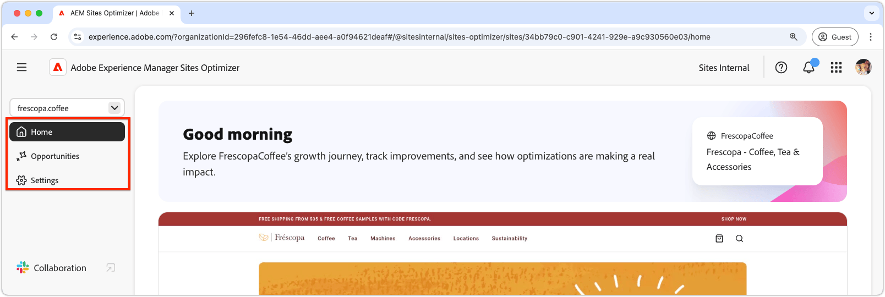

# Basisbegrippen voor Sites Optimizer

{align="center"}

Het Sites Optimizer-dashboard biedt een overzicht op hoog niveau van de prestaties en mogelijkheden van uw site voor verbetering.

## Domeinbeheer

{align="center"}

Met het contextmenu van de domeincontroller kunt u de AEM-site per domein kiezen die u wilt beoordelen en optimaliseren. Sites Optimizer verstrekt een lijst van alle plaatsen van productieAEM die in [ worden geregistreerd Cloud Manager ](https://experienceleague.adobe.com/nl/docs/experience-manager-cloud-service/content/implementing/using-cloud-manager/edge-delivery-sites/add-edge-delivery-site).

## Navigatie

{align="center"}

De sectie Navigatie biedt snel en permanent toegang tot belangrijke gebieden van de Sites Optimizer vanaf elke willekeurige locatie in Sites Optimizer, waaronder:

* **Huis** - het belangrijkste dashboard, dat een overzicht op hoog niveau van de prestaties en de kansen van uw plaats voor verbetering verstrekt.
* **Kansen** - bekijk en beheer de kansen die door Sites Optimizer worden geïdentificeerd, met inbegrip van die kansen die zijn geoptimaliseerd of niet geoptimaliseerd blijven.
* **Montages** - vorm uw montages van Sites Optimizer, met inbegrip van de plaatsen u controleert en de berichten u ontvangt.

## Overzicht van site

{align="center"}

De sectie Site Summary biedt een momentopname van de prestaties van uw site, hoe Sites Optimizer uw site in de loop der tijd heeft verbeterd en mogelijkheden voor verbetering. De belangrijkste metriek omvatten:

* **Geoptimaliseerde Kansen** - het aantal geïdentificeerde kansen die zijn verbeterd om bedrijfsprestaties te verbeteren.
* **Kansen hangende** - het aantal potentiële verbeteringen die niet geoptimaliseerd blijven, die gebieden voor bedrijfswinsten vertegenwoordigen.
* **het verkeerswaarde van het Project** - de verandering in geschatte waarde van het verkeer van uw website vergeleken bij vorige maand, die de bijdrage van de Optimizer van de Plaats aan bedrijfsdoelstellingen helpt meten.
* **de verandering van Vensters** - de percentageverschuiving in hoe vaak uw plaats wordt bekeken, die gebruikersinteresse en inhoudsdoeltreffendheid weerspiegelen.
* **klik tariefverandering** - de percentageverandering in hoe vaak de gebruikers klikken, wijzend op verschuivingen in overeenkomst en omzettingspotentieel.
* **de snelheid van de Plaats** - een zeer belangrijke indicator van de snelheid en bruikbaarheid van uw website, die gebruikerservaring en onderzoeksrangschikkingen beïnvloedt.

## Hoge impactmogelijkheden

{align="center"}

De sectie Hoge Kansen van het Effect benadrukt de belangrijkste hangende kansen voor verbetering, die op hun potentiële effect op de prestaties van uw plaats wordt gebaseerd. Deze mogelijkheden zijn ingedeeld per type, waardoor u eenvoudig prioriteiten kunt stellen bij uw optimaliseringsinspanningen.

De kansen van de filter door sleutelwoorden, markeringen, URLs, of [ opportuniteitstype ](../opportunity-types/overview.md) om op de meest kritieke gebieden van verbetering te concentreren.

### Opportuniteitsdetails

{align="center"}

Elke gelegenheid biedt een korte beschrijving van het probleem, de mogelijke gevolgen voor uw site en een link naar volledige informatie. U kunt ook de status bekijken, om aan te geven of de toepassing is geoptimaliseerd of nog in behandeling is.

* **titel van de Kans** - een korte beschrijving van de kwestie en zijn potentiële effect op de prestaties van uw plaats.
* **Laatst bijgewerkt** - Sites Optimizer werkte de kans met nieuwe gegevens op deze datum laatst bij.
* **Aantal van de Uitgave** - het aantal instanties van de kwestie die op uw plaats wordt geïdentificeerd.
* **types van Kans** - de [ types van kans ](../opportunity-types/overview.md) dat deze kans deel van - zoals verkeersaanwinst, overeenkomst, omzetting, of plaatsgezondheid uitmaakt.

De summiere informatie voor elke kans varieert door type en kan details over opbrengsteffect, verkeer, gebruikersovereenkomst, of veiligheidsbedreigingen omvatten.

Om de details van een kans te bekijken, klik de **knoop van Details**.

Om een kans van het dashboard en de rapporten van Sites Optimizer uit te sluiten, klik **negeren** knoop.
