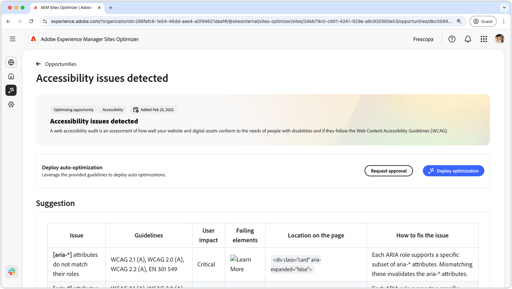

# Toegankelijkheidsproblemen

{align="center"}

De kansen van toegankelijkheidskwesties identificeren hoe goed uw website aan de behoeften van mensen met handicaps voldoet en als zij de [ Richtlijnen van de Toegang van de Inhoud van het Web (WCAG) ](https://www.w3.org/TR/WCAG21/) volgen. Door te beoordelen hoe goed uw site voldoet aan WCAG, kunt u een inclusieve online ervaring creëren. Op hun beurt kunnen personen met een visuele, auditieve, cognitieve en motorische handicap navigeren, communiceren met en profiteren van uw inhoud. Deze functionaliteit is niet alleen om ethische redenen essentieel, maar bevordert ook de naleving van wettelijke vereisten, verbetert SEO, en kan uw publiek bereiken verhogen, zowel gebruikerservaring als bedrijfsprestaties verbeteren.

## Automatische identificatie

{align="center"}

De **kans van de de kwesties van de Toegankelijkheid** identificeert toegankelijkheidskwesties op uw website, en omvat het volgende:

* **Kwesties** - de specifieke toegankelijkheidskwestie die wordt gevonden.
* **Richtlijnen** - [ identiteitskaart van de 2} richtlijnen WCAG ](https://www.w3.org/TR/WCAG21/) de kwestie in schending van is.
* **effect van de Gebruiker** - een beoordeling van het effect op gebruikers met handicaps.
* **het Ontbreken elementen** - de elementen van HTML op webpage die door de kwestie worden beïnvloed.
* **Plaats op de pagina** - het fragment van HTML van het element op de pagina die door de kwestie wordt beïnvloed.

## Automatisch voorstellen

{align="center"} voor

De auto-suggestie verstrekt AI-Gegenereerde aanbevelingen op **hoe te om het kwestie** gebied te bevestigen, dat voorschrijvende begeleiding op verstrekt wat te doen om de kwestie te bevestigen.

## Automatisch optimaliseren

[!BADGE  Ultimate ]{type=Positive tooltip="Ultimate"}

{align="center"}

Sites Optimizer Ultimate voegt de mogelijkheid toe om automatische optimalisatie te implementeren voor de gevonden kwetsbaarheden.

>[!BEGINTABS]

>[!TAB  stel optimalisering ] op

{{auto-optimize-deploy-optimization-slack}}

>[!TAB  Goedkeuring van het Verzoek ]

{{auto-optimize-request-approval}}

>[!ENDTABS]

## Zie ook

[Forms-mogelijkheden voor toegankelijkheidsproblemen](/help/documentation/opportunities/forms-accessibility-issues.md)