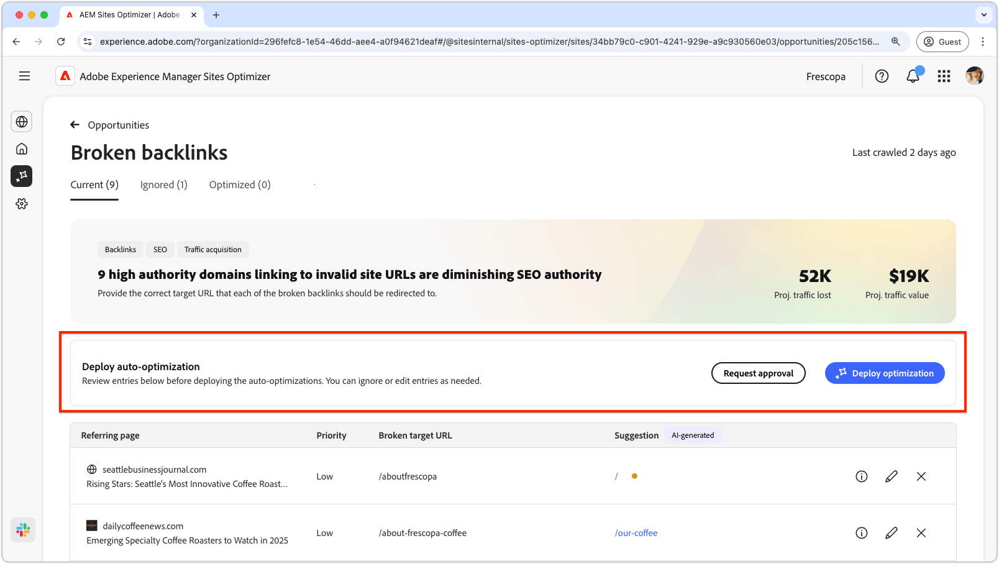
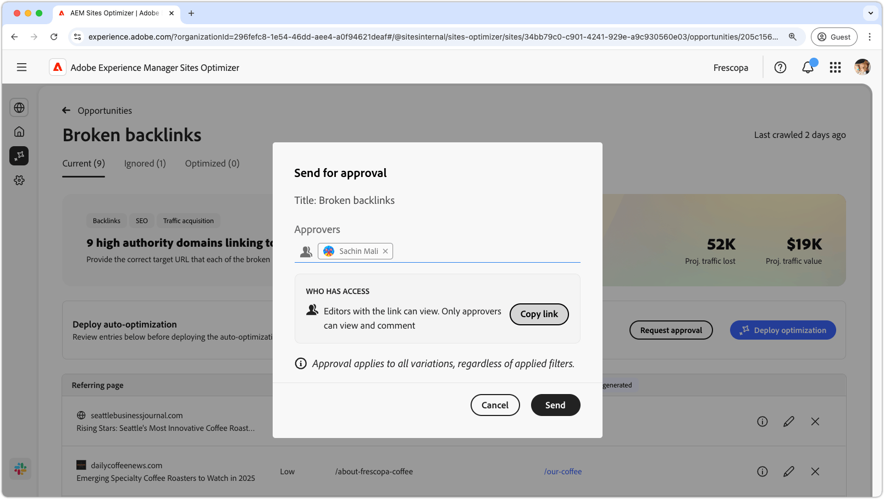

# Verbroken backlinking

{align="center"}

Bij de kans op verbroken back-ups worden koppelingen van andere websites naar uw site geïdentificeerd die tot een fout van 404 leiden. Aangezien zoekprogramma&#39;s achtergronden gebruiken om de relevantie van zoekopdrachten te bepalen, kunnen verbroken koppelingen de SEO en ontdekkingsmogelijkheden van uw site negatief beïnvloeden. Deze problemen kunnen het gevolg zijn van bijvoorbeeld wijzigingen in de URL of het verwijderen van de gekoppelde pagina.

De gebroken backs-kans toont een samenvatting bij de bovenkant van de pagina, met inbegrip van een synopsis van het probleem en zijn effect op uw plaats en zaken.

* **Geprojecteerd verloren verkeer** - het geschatte verkeersverlies toe te schrijven aan gebroken backlinks.
* **Geprojecteerde verkeerswaarde** - de geschatte waarde van het verloren verkeer.

## Automatische identificatie

{align="center"}

De gebroken backlinks kans maakt een lijst van alle gebroken backlinks op uw plaats, met inbegrip van:

* **Verwijzend pagina** - het websitedomein dat de gebroken verbinding bevat.
* **Prioriteit** - Hoog, middelgroot, of laag, die op het effect wijzen de gebroken verbinding op SEO heeft die op TODO wordt gebaseerd.
* **Verbroken doel URL** - niet bestaande URL op uw plaats die met wordt verbonden.

## Automatisch voorstellen

{align="center"}

De kans op verbroken backs biedt ook door AI gegenereerde suggesties voor de pagina op uw website waarnaar de verbroken URL moet worden omgeleid. De suggesties zijn gebaseerd op de tekst die de verbroken URL en de inhoud van de voorgestelde pagina bevat.

>[!BEGINTABS]

>[!TAB  AI rationale ]

{align="center"}

Selecteer het **informatie** pictogram om de AI redenering voor voorgestelde URL te bekijken. De redenering verklaart waarom AI gelooft dat voorgestelde URL het beste geschikt voor de gebroken verbinding is. Dit kan u helpen het besluitvormingsproces van AI begrijpen en een weloverwogen beslissing nemen over het al dan niet aanvaarden of verwerpen van de suggestie.

>[!TAB  geef doel URL ] uit

{align="center"}

Als u met de AI-Gegenereerde suggestie oneens bent, kunt u voorgestelde URL uitgeven door **te selecteren geef pictogram** uit. Op deze manier kunt u handmatig de URL invoeren die u het beste geschikt acht voor de verbroken koppeling. Sites Optimizer vermeldt ook andere URL&#39;s op uw site waarvan het meent dat deze geschikt zijn voor de verbroken koppeling.

>[!TAB  negeer ingangen ]

{align="center"}

U kunt ervoor kiezen om vermeldingen met de verbroken doel-URL te negeren. Het selecteren van **negeert pictogram** verwijdert gebroken backlink uit de opportuniteitslijst. Genegeerde gebroken backlinks kunnen van het **Genegeerde** lusje bij de bovenkant van de opportuniteitspagina opnieuw worden geëngageerd.

>[!ENDTABS]

## Auto-optimaliseer [!BADGE  Ultimate ]{type=Positive tooltip="Ultimate"}

{align="center"}

Sites Optimizer Ultimate voegt de mogelijkheid toe om automatische optimalisatie voor verbroken backs te implementeren. Het selecteren van **auto-optimaliseert** knoop werkt automatisch de het omleiden van de Plaats van AEM regels bij om het **gebroken doel URL** aan **gesuggereerde URL** in kaart te brengen. Dit verzekert websitebezoekers en onderzoeksbots na de gebroken verbindingen op **verwijzende pagina&#39;s** aan de correcte pagina op uw plaats worden opnieuw gericht, verbeterend SEO en gebruikerservaring.

>[!BEGINTABS]

>[!TAB  stel optimalisering ] op

{align="center"}

Het selecteren **stelt optimalisering** op zal de het omleiden van de Plaats van AEM regels bijwerken om het **gebroken doel URL** aan **gesuggereerde URL** in kaart te brengen. Dit verzekert websitebezoekers en onderzoeksbots na de gebroken verbindingen op **verwijzende pagina&#39;s** aan de correcte pagina op uw plaats worden opnieuw gericht, verbeterend SEO en gebruikerservaring.

>[!TAB  Goedkeuring van het Verzoek ]

{align="center"}

{{auto-optimize-request-approval}}

>[!ENDTABS]
