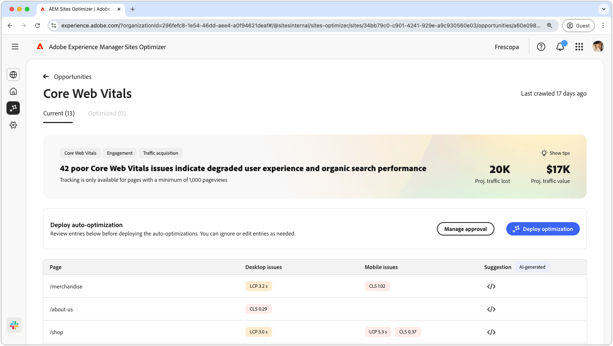

# Kernwebvitaliteit

{align="center"}

De belangrijkste kans van het Web van vitals identificeert kwesties die de gebruikerservaring en de biologische onderzoeksprestaties van uw Web-pagina&#39;s kunnen degraderen. Deze problemen zijn het gevolg van verschillende factoren, zoals aangepaste lettertypen, niet-geoptimaliseerde JavaScript-afhankelijkheden, scripts van derden enzovoort. De belangrijkste kans op internet wijst op deze onvolkomenheden en stelt oplossingen voor die de prestaties van uw webpagina kunnen verbeteren. Houd er rekening mee dat alleen pagina&#39;s met weergaven van minstens 1000 pagina&#39;s kunnen worden geanalyseerd.

Om te beginnen geeft de belangrijkste webvitals-kans boven aan de pagina een overzicht weer, inclusief een overzicht van het probleem en de impact ervan op uw site en uw bedrijf.

* **Geprojecteerd verloren verkeer** - het geschatte verkeersverlies toe te schrijven aan kernWeb vitals die onder prestatiesdrempels zijn.
* **Geprojecteerde verkeerswaarde** - de geschatte waarde van het verloren verkeer.

## Automatische identificatie

{align="center"}

In het onderste gedeelte van de pagina hebt u een lijst met alle huidige uitgaven gegroepeerd als:

* **Mobiele kwesties** - een lijst van kwesties die de mobiele versie van de pagina beïnvloeden.
* **de kwesties van de Desktop** - een lijst van kwesties die de Desktopversie van de pagina beïnvloeden.

Elke kwestie wordt getoond in een lijst, met de **kolom van de Pagina** identificerend de beïnvloede paginaingang.

Het systeem groepeert deze kwesties door de standaardprestatiesmetriek in het rapport van de Kernwebvariaties:

* grootste inhoudelijke verf **LCP**
* interactie aan volgende verf **INP**
* cumulatieve lay-outverschuiving **CLS**

## Automatisch voorstellen

{align="center"}

De belangrijkste kans van het Web van vitals verstrekt AI-Gegenereerde fixingssuggesties. Wanneer u de suggesties klikt knoop, verschijnt een nieuw venster dat de prestatiesmetriek **LCP**, **INP** en **CLS** als categorieën bevat. U kunt tussen deze categorieën schakelen om een lijst met specifieke kwesties te zien.

Elke categorie kan verschillende problemen bevatten, zodat u omlaag kunt schuiven om de volledige lijst met problemen en aanbevelingen weer te geven.  Bovendien zijn er twee prestatiebreedten voor zowel mobiel als bureaublad voor elke meting.

## Automatisch optimaliseren

[!BADGE &#x200B; Ultimate &#x200B;]{type=Positive tooltip="Ultimate"}

{align="center"}

Sites Optimizer Ultimate voegt de mogelijkheid toe om automatische optimalisatie te implementeren voor de problemen die worden aangetroffen door de belangrijkste webvitals-mogelijkheid. <!--- TBD-need more in-depth and opportunity specific information here. What does the auto-optimization do?-->

>[!BEGINTABS]

>[!TAB stel optimalisering  op]

{{auto-optimize-deploy-optimization-slack}}

>[!TAB  Goedkeuring van het Verzoek ]

{{auto-optimize-request-approval}}

>[!ENDTABS]

