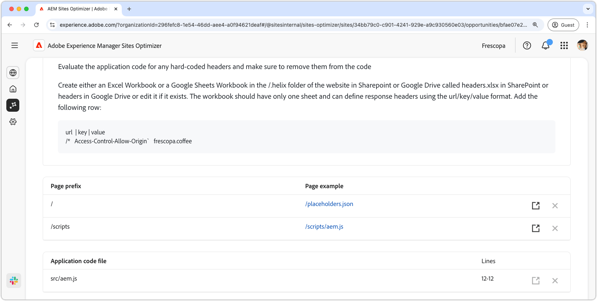

# Mogelijkheid voor CORS-configuratie

{align="center"}

Het correct configureren van het delen van bronnen van oorsprong (CORS) is essentieel voor het beveiligen van webtoepassingen tegen ongeoorloofde gegevenstoegang. Wanneer de header `Access-Control-Allow-Origin` is ingesteld op `*` , kan elk domein reacties aanvragen en ontvangen, waarbij gevoelige informatie mogelijk aan aanvallers wordt getoond. Dit biedt een kans om de veiligheid te versterken door een gecontroleerde lijst van gewenste personen van vertrouwde domeinen uit te voeren of CORS onbruikbaar te maken waar het niet wordt vereist. Door een veilige installatie van CORS te garanderen, helpt u persoonlijke inhoud te beschermen en zorgt u voor naadloze toegang voor geautoriseerde gebruikers.

## Automatische identificatie

{align="center"}

Met Automatisch identificeren kunt u uw website scannen op onjuiste CORS-configuraties en URL&#39;s detecteren die mogelijk zijn voor onbevoegde toegang. Deze URL&#39;s worden in de bovenste tabel weergegeven, samen met de volgende details:

* **prefix van de Pagina** - de URL wegprefix die aan misconfiguration CORS kwetsbaar is.
* **Voorbeeld van de Pagina** - een voorbeeld URL die aan onbevoegde toegang vatbaar is.

## Automatisch voorstellen

{align="center"}

De auto-voorstellen verstrekt van **dossiers van de code van de Toepassing** en hun **Lijnen** om worden herzien die laks beleid van CORS kunnen plaatsen.

## Automatisch optimaliseren

[!BADGE &#x200B; Ultimate &#x200B;]{type=Positive tooltip="Ultimate"}

>[!BEGINTABS]

>[!TAB stel optimalisering  op]

{{auto-optimize-deploy-optimization-slack}}

>[!TAB  Goedkeuring van het Verzoek ]

{{auto-optimize-request-approval}}

>[!ENDTABS]
