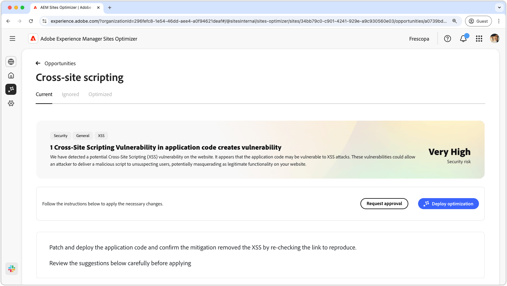
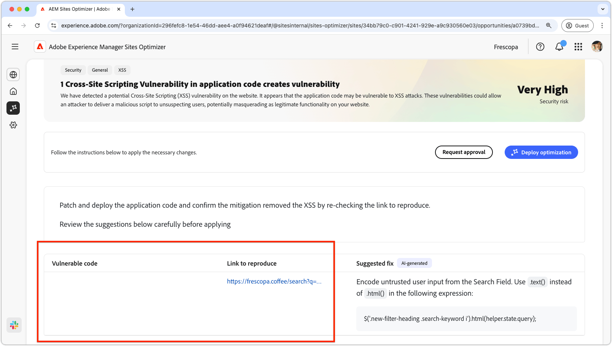

# Geschiktheid voor scripts die naar andere sites verwijzen

{align="center"}

Met de scriptmogelijkheid voor andere sites worden kwetsbaarheden in de code van uw site geïdentificeerd en gecorrigeerd die door aanvallers kunnen worden benut om schadelijke scripts te injecteren in webpagina&#39;s die door andere gebruikers worden weergegeven. Deze scripts kunnen vertrouwelijke informatie stelen, zoals sessiecookies, of acties uitvoeren namens de gebruiker, zoals het wijzigen van het wachtwoord van de gebruiker.

## Automatische identificatie

{align="center"}

* **Kwetsbare code** - om het even welke code die aan dwars-plaats scripting aanvallen kwetsbaar is.
* **Verbinding om** te reproduceren - de verbinding aan de pagina waar de kwetsbaarheid werd gevonden.

## Automatisch voorstellen

{align="center"}

* **stelde moeilijke situatie** voor - een AI-Gegenereerde suggestie op hoe te om de kwetsbaarheid te bevestigen.

## Automatisch optimaliseren

[!BADGE &#x200B; Ultimate &#x200B;]{type=Positive tooltip="Ultimate"}

>[!BEGINTABS]

>[!TAB stel optimalisering  op]

{{auto-optimize-deploy-optimization-slack}}

>[!TAB  Goedkeuring van het Verzoek ]

{{auto-optimize-request-approval}}

>[!ENDTABS]
