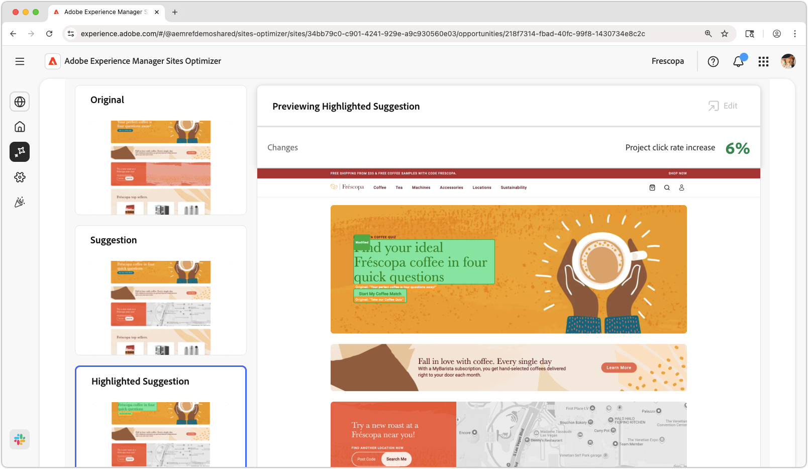

# De hoge verkeerspagina heeft lage kansen CTR

{align="center"}

De hoge verkeerspagina heeft lage kans CTR identificeert pagina&#39;s op uw website die een significante hoeveelheid verkeer ontvangen maar een laag klikthrough tarief (CTR) hebben. Door deze pagina&#39;s te analyseren, kunt u mogelijke problemen ontdekken die de betrokkenheid van gebruikers kunnen belemmeren en stappen nemen om hun prestaties te verbeteren. Deze mogelijkheid is essentieel voor het optimaliseren van de inhoud en lay-out van uw website, wat uiteindelijk leidt tot hogere conversietarieven en betere gebruikerservaring.

## Automatische identificatie

{align="center"}

De **Hoge het verkeerspagina heeft lage kansen CTR** identificeert hoge verkeerspagina&#39;s met lage CTR op uw website, en omvat het volgende:

* **Aanbeveling** - stelde actie voor om CTR van de pagina te verbeteren.
* **Insight** - Verklaring van waarom de pagina een lage CTR heeft.
* **Achtergrond** - het redeneren achter de aanbeveling.

## Automatisch voorstellen

{align="center"}

Automatisch voorstellen biedt door AI gegenereerde suggesties voor hoe een geoptimaliseerde webervaring eruit zou kunnen zien. De suggesties omvatten a **benadrukte** mening die het gemakkelijk maken om te zien welke veranderingen worden voorgesteld.

Suggesties kunnen worden geselecteerd om ze in volledige weergave te bekijken, hun verwachte CTR-effect en de mogelijkheid om ze te bewerken voordat ze op de pagina worden toegepast.

## Automatisch optimaliseren

[!BADGE  Ultimate ]{type=Positive tooltip="Ultimate"}

{align="center"}

Sites Optimizer Ultimate voegt de mogelijkheid toe om automatische optimalisatie te implementeren voor de voorgestelde optimalisatie.

>[!BEGINTABS]

>[!TAB  stel optimalisering ] op

{{auto-optimize-deploy-optimization-slack}}

>[!TAB  Goedkeuring van het Verzoek ]

{{auto-optimize-request-approval}}

>[!ENDTABS]
