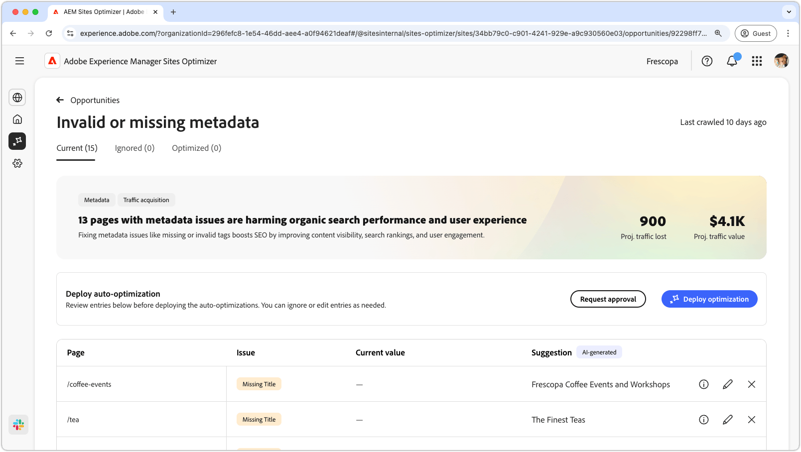
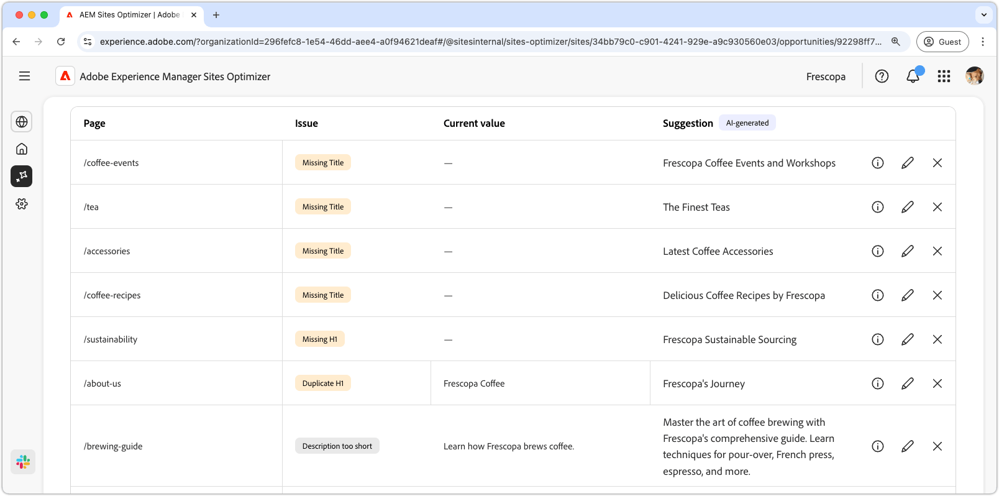

# Ongeldige of ontbrekende metagegevensmogelijkheid

{align="center"}

De ongeldige of ontbrekende metagegevensmogelijkheid identificeert ontbrekende of onjuiste metagegevens op uw webpagina&#39;s. Door problemen met metagegevens op te lossen wordt de SEO verhoogd door de zichtbaarheid van inhoud, zoekresultaten en de betrokkenheid van gebruikers te verbeteren. Dergelijke problemen kunnen ontstaan door ontbrekende of ongeldige tags, te lange of te korte beschrijvingen enzovoort.

De ongeldige of ontbrekende meta-gegevenskans toont een samenvatting bij de bovenkant van de pagina, met inbegrip van een synopsis van het probleem en zijn effect op uw plaats en zaken.

* **Geprojecteerd verloren verkeer** - het geschatte verkeersverlies toe te schrijven aan defecte meta-gegevens.
* **Geprojecteerde verkeerswaarde** - de geschatte waarde van het verloren verkeer.

## Automatische identificatie

{align="center"}

De ongeldige of ontbrekende meta-gegevenskans maakt een lijst van alle defecte meta-gegevens op uw pagina&#39;s, en omvat het volgende:

* **Pagina** - de pagina die ongeldige of ontbrekende meta-gegevens bevat.
* **Uitgave** - wijst op het type van kwestie die de meta-gegevensmarkering beïnvloedt. Deze uitgaven kunnen variëren van ontbrekende titels tot dubbele H1&#39;s enzovoort.
* **Waarde** - de huidige waarde van de meta-gegevensmarkering die moet worden veranderd.
* **Suggestie** - een AI-Gegenereerde suggestie voor geschikte markeringsupdates. Zie de onderstaande sectie voor meer informatie.

## Automatisch voorstellen

{align="center"}

De ongeldige of ontbrekende metagegevensmogelijkheid biedt ook door AI gegenereerde suggesties voor het wijzigen of bijwerken van de metagegevenstags. Deze suggesties zijn gebaseerd op de oorspronkelijke tag die de metagegevens in de fout bevatte en op de inhoud van de voorgestelde update.

>[!BEGINTABS]

>[!TAB  AI rationale ]

Het selecteren van  verstrekt de AI redenering voor de voorgestelde update.

>[!TAB  Aanbevolen metagegevenswaarde bewerken ]

{align="center"}

Als u met de AI-Gegenereerde suggestie oneens bent, kunt u de voorgestelde meta-gegevenswaarde uitgeven door  te selecteren. Op deze manier kunt u handmatig de waarde invoeren die u het beste geschikt acht voor de metagegevens. Het bewerkingsvenster bevat het volgende:

* **Weg** - de weg aan de pagina die de meta-gegevens (of gebrek van) bevat.
* **beschrijving van de kwestie** - wijst op het type van kwestie die de meta-gegevensmarkering en een korte beschrijving beïnvloeden.
* **Suggestie voor markeringswaarde** - de AI-Gegenereerde suggestie op hoe te om de meta-gegevensmarkering te veranderen of bij te werken. Bijvoorbeeld, hoeveel karakters zou de markeringsupdate moeten bevatten etc.
* **Originele de markeringsinhoud van het EIND** - de originele markeringswaarde.
* **de markeringswaarde van het Doel** - geef dit gebied uit en voeg manueel de gewenste markeringswaarde toe. Wanneer u **sparen** selecteert, wordt de waarde toegepast op de voorgestelde update.
* **Suggestie** - de AI-Gegenereerde suggestie op hoe te om de waarde te veranderen.
* **sparen** - bewaart en past de waarde op het **gebied van de de markeringswaarde van het Doel** toe.

>[!TAB  negeer ingangen ]

U kunt items met de beoogde verbroken of ongeldige metagegevens negeren. Het selecteren van  verwijdert de ingang uit de opportuniteitslijst. De genegeerde ingangen kunnen van het **Genegeerde** lusje bij de bovenkant van de opportuniteitspagina opnieuw worden aangehaald.

>[!ENDTABS]

## Automatisch optimaliseren

[!BADGE &#x200B; Ultimate &#x200B;]{type=Positive tooltip="Ultimate"}

{align="center"}

Sites Optimizer Ultimate voegt de mogelijkheid toe om automatische optimalisatie te implementeren voor de problemen die worden gevonden door de ongeldige of ontbrekende metagegevensmogelijkheid. <!--- TBD-need more in-depth and opportunity specific information here. What does the auto-optimization do?-->

>[!BEGINTABS]

>[!TAB stel optimalisering  op]

{{auto-optimize-deploy-optimization-slack}}

>[!TAB  Goedkeuring van het Verzoek ]

{{auto-optimize-request-approval}}

>[!ENDTABS]
