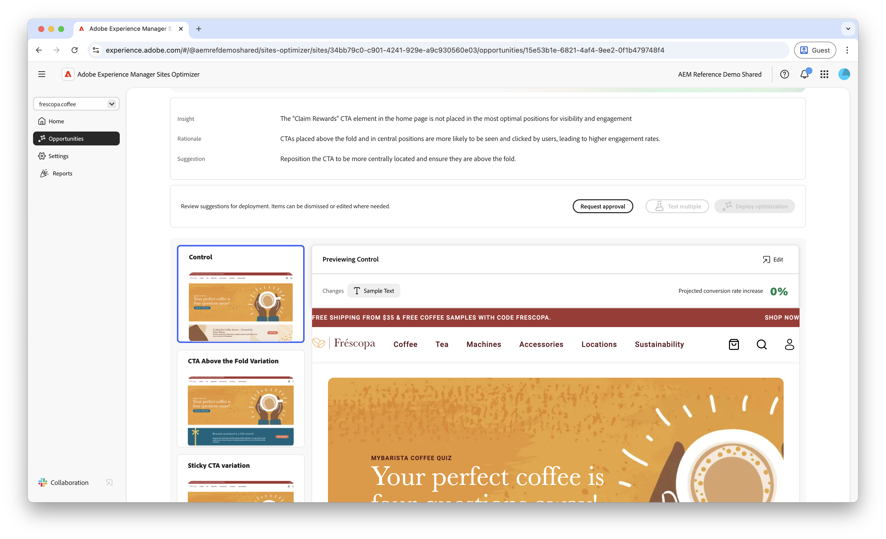

# Forms lage navigatiemogelijkheid

 De Forms-optimalisatiefunctie is beschikbaar in het programma voor vroege toegang. U kunt vanaf uw officiële e-mailadres naar aem-forms-ea@adobe.com schrijven om deel te nemen aan het vroege toegangsprogramma en toegang tot de mogelijkheden te vragen. 

{align="center"}

De lage navigatiemogelijkheid identificeert formulieren op uw website met lage navigatiesnelheden. Met dit opportuniteitstype kunt u beter begrijpen welke formulieren niet worden gedetecteerd of geopend door gebruikers en kunt u suggesties doen om de ontdekkingsmogelijkheden te verbeteren.

## Automatische identificatie

{align="center"}

Elke webpagina met vormen met lage navigatie is vermeld als zijn eigen **Lage navigatie** kans. Boven aan de opportunitypagina wordt een korte samenvatting van de opportuniteit en de redenering weergegeven.

## Automatisch voorstellen

 voor

Automatisch suggesties geven door AI gegenereerde formuliervariaties die zijn ontworpen om de navigatie naar uw formulieren te verbeteren. Elke variatie toont de **geprojecteerde verhoging van het omzettingspercentage** die op zijn potentieel wordt gebaseerd om vormontdekkingsbaarheid en toegankelijkheid te verbeteren, die u helpen aan de meest efficiënte suggesties voorrang geven.

>[!BEGINTABS]

>[!TAB  de variatie van de Controle ]

{align="center"}

De besturingsvariant zijn de oorspronkelijke formulieren die op dat moment actief zijn op uw website. Deze variatie wordt gebruikt als basislijn om de prestaties van de voorgestelde variaties te vergelijken.

>[!TAB  Voorgestelde variaties ]

{align="center"}

De voorgestelde variaties zijn door AI gegenereerde formuliervariaties die zijn ontworpen om de navigatie naar uw formulieren te verbeteren. Elke variatie toont de **geprojecteerde verhoging van het omzettingspercentage** die op zijn potentieel wordt gebaseerd om vormontdekkingsbaarheid en toegankelijkheid te verbeteren, die u helpen aan de meest efficiënte suggesties voorrang geven.

Klik op elke variatie om een voorvertoning weer te geven aan de rechterkant van het scherm. Boven aan het voorbeeld zijn de volgende acties en informatie beschikbaar:

* **Veranderingen** - een korte samenvatting van wat in deze variatie van de **controle** variatie veranderde.
* **de Verhoging van de Verwachte omzettingssnelheid** - de geschatte toename in vormenovereenkomst als deze variatie wordt uitgevoerd.
* **geeft** uit - klik om de variatie in het auteursrecht van AEM uit te geven.

>[!ENDTABS]

<!-- 

## Auto-optimize

[!BADGE Ultimate]{type=Positive tooltip="Ultimate"}

{align="center"}

Sites Optimizer Ultimate adds the ability to deploy auto-optimization for the issues found by the low navigation opportunity.

>[!BEGINTABS]

>[!TAB Test multiple]

>[!TAB Publish selected]

{{auto-optimize-deploy-optimization-slack}}

>[!TAB Request approval]

{{auto-optimize-request-approval}}

>[!ENDTABS]

-->
