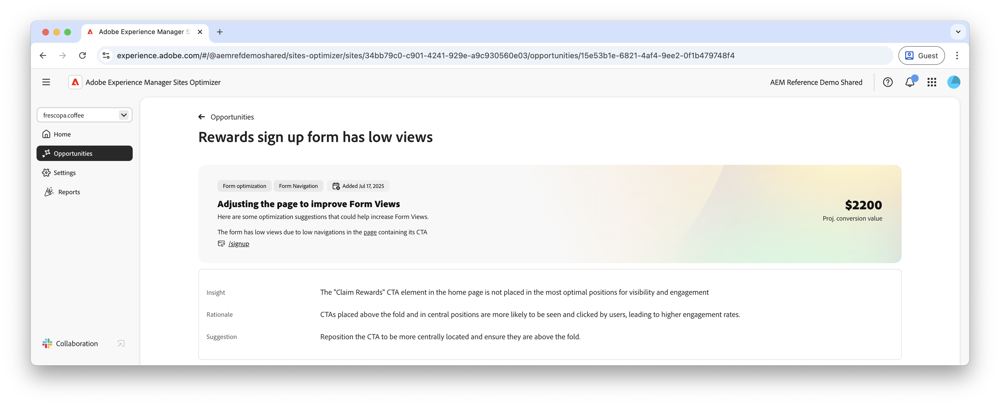

# Lage weergavemogelijkheid

{align="center"}

De lage weergavemogelijkheid identificeert formulieren op uw website met een lage weergavesnelheid. Deze kans helpt u te begrijpen welke formulieren niet goed presteren en biedt suggesties voor het verbeteren van hun betrokkenheidspercentages. Door de weergave van uw formulieren te optimaliseren, kunt u het aantal verzonden formulieren verhogen en de algehele prestaties van uw website verbeteren.

## Automatische identificatie

{align="center"}

Elke webpagina met een vorm met lage meningen is vermeld als zijn eigen **Lage meningen** kans. Boven aan de opportuniteitspagina wordt een korte samenvatting van de opportuniteit en de AI-redenering weergegeven.

## Automatisch voorstellen

{align="center"} voor

Automatisch voorstellen biedt door AI gegenereerde webpaginamarges die ontworpen zijn om de weergave van uw formulieren te vergroten. Elke variatie toont de **verhoging van de het tarief van de projectomzetting** die op zijn potentieel wordt gebaseerd om vormovereenkomst te verbeteren, die u helpt aan de meest efficiënte suggesties voorrang geven.

>[!BEGINTABS]

>[!TAB  de variatie van de Controle ]

{align="center"}

De besturingsvariant is het oorspronkelijke formulier dat op dit moment live is op uw website. Deze variatie wordt gebruikt als basislijn om de prestaties van de voorgestelde variaties te vergelijken.

>[!TAB  Voorgestelde variaties ]

{align="center"}

De voorgestelde variaties zijn door AI gegenereerde webpaginavariaties die zijn ontworpen om de weergaven van uw formulieren te vergroten. Elke variatie toont de **geprojecteerde verhoging van het omzettingspercentage** die op zijn potentieel wordt gebaseerd om vormovereenkomst te verbeteren, die u helpt aan de meest efficiënte suggesties voorrang geven.

Klik op elke variatie om een voorvertoning weer te geven aan de rechterkant van het scherm. Boven aan het voorbeeld zijn de volgende acties en informatie beschikbaar:

* **Veranderingen** - een korte samenvatting van wat in deze variatie van de **controle** variatie veranderde.
* **Verhoging van de Verwachte omzettingssnelheid** - de geschatte toename in vormovereenkomst als deze variatie wordt uitgevoerd.
* **geeft** uit - klik om de variatie in het auteursrecht van AEM uit te geven.

>[!ENDTABS]

## Automatisch optimaliseren

[!BADGE  Ultimate ]{type=Positive tooltip="Ultimate"}

{align="center"}

Sites Optimizer Ultimate voegt de mogelijkheid toe om automatische optimalisatie te implementeren voor de problemen die worden gevonden door de lage weergavemogelijkheid.

>[!BEGINTABS]

>[!TAB  Test veelvoudige ]

>[!TAB  publiceer geselecteerde ]

{{auto-optimize-deploy-optimization-slack}}

>[!TAB  Goedkeuring van het Verzoek ]

{{auto-optimize-request-approval}}

>[!ENDTABS]
