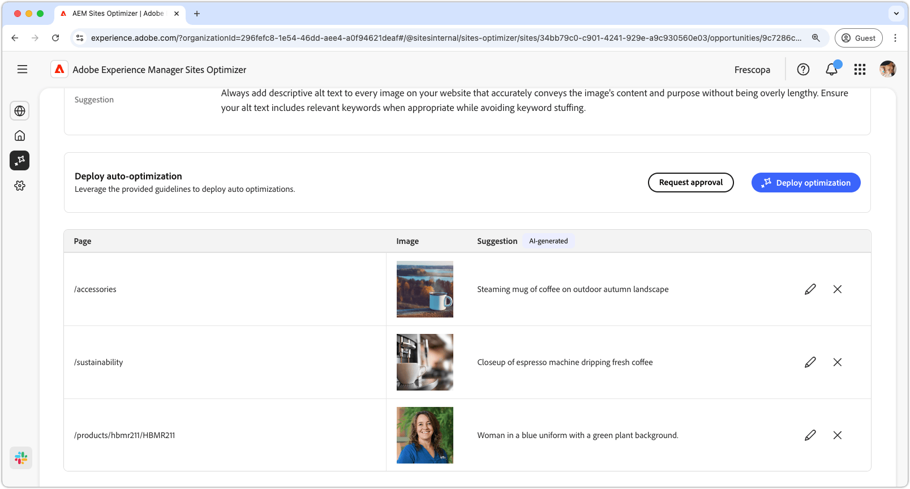

# Ontbrekende alternatieve tekstmogelijkheid

{align="center"}

Met de kans op ontbrekende alternatieve tekst worden afbeeldingen zonder beschrijvende alternatieve tekst op uw website geïdentificeerd. Zoekprogramma&#39;s kunnen afbeeldingen zonder alternatieve tekst niet correct indexeren of begrijpen. Deze functionaliteit vermindert aanzienlijk de ontdekkingsmogelijkheden en zoekpositie van uw inhoud en beperkt uiteindelijk het bereik van uw publiek. Bovendien worden personen met een visuele handicap die vertrouwen op schermlezers, uitgesloten van het gebruik van alt-tekst voor afbeeldingen, waardoor belemmeringen voor de toegang tot informatie ontstaan.

De ontbrekende mogelijkheid voor alternatieve tekst geeft boven aan de pagina een overzicht weer, inclusief een overzicht van het probleem en de gevolgen ervan voor uw site en bedrijf.

* **Geprojecteerd verloren verkeer** - het geschatte verkeersverlies toe te schrijven aan de ontbrekende alt tekst.
* **Geprojecteerde verkeerswaarde** - de geschatte waarde van het verloren verkeer.

Er is ook een aanvullend veld dat de redenering, insight en suggesties met betrekking tot de mogelijkheid weergeeft.

## Automatische identificatie

{align="center"}

Bij de kans op ontbrekende alternatieve tekst worden alle afbeeldingen op uw website weergegeven die alternatieve tekst ontbreken. Deze sectie bevat de volgende categorieën:

* **Pagina** - de weg aan de pagina die de ontbrekende alt tekst bevat.
* **Beeld** - het beeld dat de beschrijvende alt tekst mist.
* **Suggestie** - een AI-Gegenereerde suggestie voor de alt tekst.

## Automatisch voorstellen

{align="center"}

Automatisch voorstellen biedt door AI gegenereerde suggesties voor de alternatieve tekst van de afbeeldingen. De door AI gegenereerde suggesties zijn ontworpen om u te helpen snel alternatieve tekst aan afbeeldingen toe te voegen zonder dat u elke afbeelding handmatig moet analyseren.

>[!BEGINTABS]

>[!TAB geef ontbrekende alt tekst  uit]

{align="center"} uit

Als u met de AI-Gegenereerde suggestie oneens bent, kunt u de voorgestelde alt tekst uitgeven door **te selecteren geef pictogram** uit. Op deze manier kunt u de tekst die u het meest geschikt voor de afbeelding acht, handmatig aanpassen. Het bewerkingsvenster bevat het volgende:

* **weg van de Pagina** - een read-only gebied dat de weg aan de pagina toont waar de ontbrekende alt tekstkwestie voorkomt. Klik op de pijl naast het pad om de bijbehorende pagina te openen.
* **Beeld** - een read-only voorproef van het beeld dat alt tekst vereist.
* **ALT tekst van het Doel** - een editable gebied waar u een beschrijvende alt tekst voor het beeld kunt manueel ingaan. Zorg ervoor dat de alt-tekst de inhoud en het doel van de afbeelding duidelijk beknopt overbrengt. Voeg indien nodig natuurlijk trefwoorden toe zonder deze te veel te laden.

>[!TAB  negeer ingangen ]

U kunt vermeldingen in de opportuniteitslijst negeren. Het selecteren van  verwijdert de ingang uit de lijst. De genegeerde ingangen kunnen van het **Genegeerde** lusje bij de bovenkant van de opportuniteitspagina opnieuw worden aangehaald.

>[!ENDTABS]

## Automatisch optimaliseren

[!BADGE &#x200B; Ultimate &#x200B;]{type=Positive tooltip="Ultimate"}

{align="center"}

Sites Optimizer Ultimate voegt de mogelijkheid toe om automatische optimalisatie te implementeren voor de problemen die worden gevonden door de ontbrekende alternatieve tekstmogelijkheid. <!--- TBD-need more in-depth and opportunity specific information here. What does the auto-optimization do?-->

>[!BEGINTABS]

>[!TAB stel optimalisering  op]

{{auto-optimize-deploy-optimization-slack}}

>[!TAB  Goedkeuring van het Verzoek ]

{{auto-optimize-request-approval}}

>[!ENDTABS]
