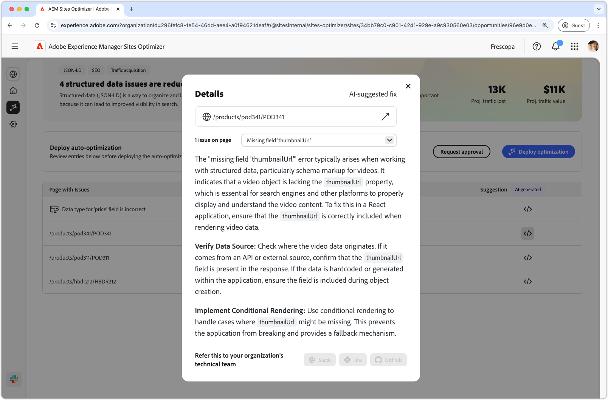
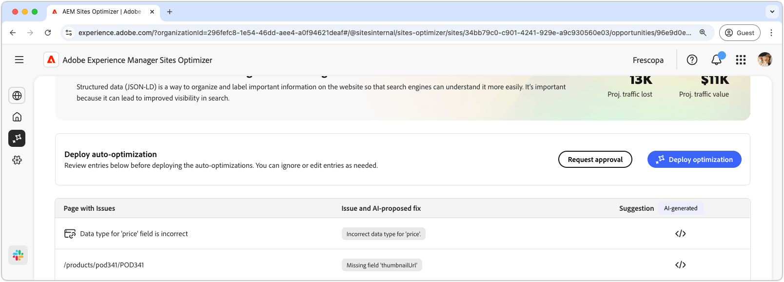

# Ontbrekende of ongeldige gestructureerde gegevensmogelijkheid

{align="center"}

De ontbrekende of ongeldige gestructureerde gegevensmogelijkheid identificeert ontbrekende of defecte gestructureerde gegevens in de gestandaardiseerde Json-LD-indeling. Met gestructureerde gegevens kunt u belangrijke informatie op uw website ordenen, beschrijven en labelen. Zoekprogramma&#39;s kunnen de inhoud van uw pagina&#39;s beter interpreteren en de zoekresultaten worden beter zichtbaar. Betere zoekresultaten kunnen ertoe leiden dat meer gebruikers zich met uw website engageren.

De ontbrekende of ongeldige gestructureerde gegevenskans toont een samenvatting bij de bovenkant van de pagina, met inbegrip van een synopsis van het probleem en zijn effect op uw plaats en zaken.

* **Geprojecteerd verloren verkeer** - het geschatte verkeersverlies toe te schrijven aan defecte gestructureerde gegevens.
* **Geprojecteerde verkeerswaarde** - de geschatte waarde van het verloren verkeer.

## Automatische identificatie

{align="center"}

De ontbrekende of ongeldige gestructureerde gegevenskans maakt een lijst van alle kwesties die op uw pagina&#39;s worden ontdekt, en bevat de volgende categorieën:

* **Pagina met kwesties** - de pagina die ongeldige of ontbrekende gestructureerde gegevens bevat.
* **Uitgave en AI-voorgestelde moeilijke situatie** - wijst op het type van gestructureerde gegevenskwestie die de pagina beïnvloedt.
* **Suggestie** - een AI-Gegenereerde suggestie voor geschikte gestructureerde gegevensupdates. Zie de onderstaande sectie voor meer informatie.

## Automatisch voorstellen

{align="center"}

De ongeldige of ontbrekende gestructureerde gegevensmogelijkheid biedt ook door AI gegenereerde suggesties voor het wijzigen of bijwerken van de gestructureerde gegevens. Wanneer u op de knop Suggesties klikt, wordt een nieuw venster weergegeven dat het volgende bevat:

* **weg van de Pagina** - een gebied dat de weg aan de pagina met ongeldige of ontbrekende gestructureerde gegevens bevat.
* **Kwesties** - een gebied dat het aantal kwesties en een drop-down menu bevat dat van alle kwesties een lijst maakt.
* **het gebied van de Suggestie** - een AI-Gegenereerde beschrijving en suggesties voor geschikte gestructureerde gegevensupdates. U kunt naar beneden schuiven voor extra suggesties en kwesties.

## Automatisch optimaliseren

[!BADGE  Ultimate ]{type=Positive tooltip="Ultimate"}

{align="center"}

Sites Optimizer Ultimate voegt de mogelijkheid toe om automatische optimalisatie te implementeren voor de problemen die worden gevonden door de ongeldige of ontbrekende gestructureerde gegevensmogelijkheid. <!--- TBD-need more in-depth and opportunity specific information here. What does the auto-optimization do?-->

>[!BEGINTABS]

>[!TAB  stel optimalisering ] op

{{auto-optimize-deploy-optimization-slack}}

>[!TAB  Goedkeuring van het Verzoek ]

{{auto-optimize-request-approval}}

>[!ENDTABS]
