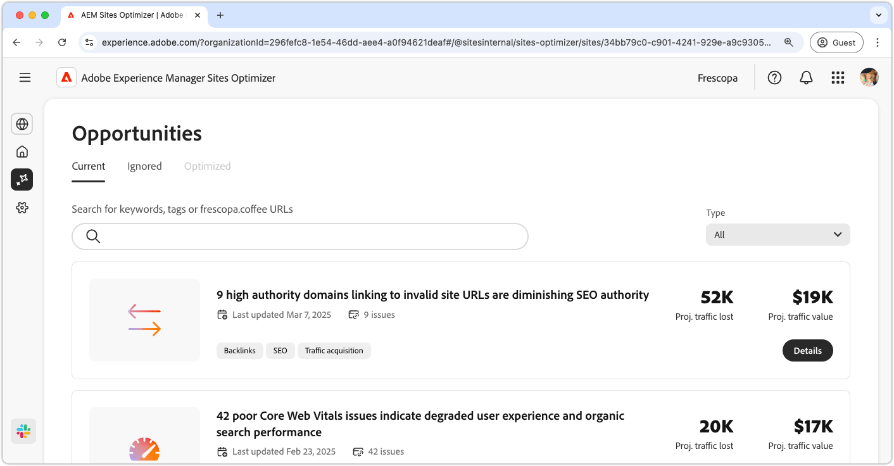
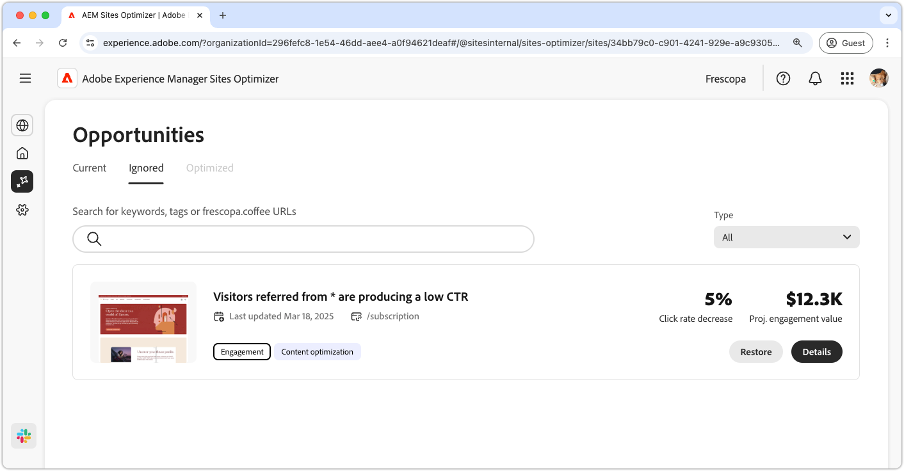

# Opportuniteitsdocumentatie

{align="center"}

Sites Optimizer bestaat uit een steeds groter wordende reeks mogelijkheden van Adobe AI, die ontworpen is om verbeteringen voor uw website te identificeren en voor te stellen. Elke kans biedt inzicht in de potentiële bedrijfswaarde, benadrukt gebieden die aandacht nodig hebben, en verstrekt activeerbare aanbevelingen voor optimalisering. Klik in elke gelegenheid om de geïdentificeerde problemen te verkennen, suggesties voor verbeteringen en stapsgewijze instructies voor het implementeren van deze wijzigingen voor verbeterde websiteprestaties en gebruikerservaring.

De kansen zijn beschikbaar via de **menuoptie 0&rbrace; Kansen &lbrace;in** de blijvende navigatie van de Optimizer van de Plaats [.](/help/documentation/basics.md#navigation)

## Opportunity-status

Gebruik de lusjes over de bovenkant om kansen door status te organiseren en te filtreren.

>[!BEGINTABS]

>[!TAB  Huidige ]

{align="center"}

Kansen die momenteel in behandeling zijn.

>[!TAB  Genegeerd ]

{align="center"}

Kansen die genegeerd zijn. Genegeerde mogelijkheden kunnen vanuit deze weergave worden hersteld.

>[!TAB  Geoptimaliseerd ]

Een historische lijst met mogelijkheden die zijn geoptimaliseerd.

>[!ENDTABS]

## Kansen

Met een [ geselecteerde opportuniteitsstatus ](#opportunity-status), kunt u een lijst van kansen bekijken. U kunt de lijst met mogelijkheden op de volgende manieren filteren:

* **Onderzoek** - Onderzoek van kansen door **sleutelwoorden, markeringen of URLs**.
* **het type van Kans** - gebruik **Type** dropdown aan filterkansen door [ opportuniteitstype ](/help/opportunity-types/overview.md).

### Opportuniteitsdetails

{align="center"}

Elke gelegenheid biedt een korte beschrijving van het probleem, de mogelijke gevolgen voor uw site en een link naar volledige informatie. U kunt ook de status bekijken, om aan te geven of de toepassing is geoptimaliseerd of nog in behandeling is.

* **titel van de Kans** - een korte beschrijving van de kwestie en zijn potentiële effect op de prestaties van uw plaats.
* **Laatst bijgewerkt** - Sites Optimizer werkte de kans met nieuwe gegevens op deze datum laatst bij.

* **Aantal van de Uitgave** - het aantal instanties van de kwestie die op uw plaats wordt geïdentificeerd.
* **types van Kans** - de [ types van kans ](/help/opportunity-types/overview.md) dat deze kans deel van - zoals verkeersaanwinst, overeenkomst, of plaatsgezondheid uitmaakt.

De summiere informatie voor elke kans varieert door type en kan details over opbrengsteffect, verkeer, gebruikersovereenkomst, of veiligheidsbedreigingen omvatten.

Om de details van een kans te bekijken, klik de **knoop van Details**.

Om een kans van het dashboard van Sites Optimizer uit te sluiten, klik **negeren** knoop.  Deze actie verplaatst de kans aan [**Genegeerde** tabel ](#opportunity-status).

## Alle mogelijkheden

Verken alle mogelijke mogelijkheden die in Sites Optimizer beschikbaar zijn:

<!-- CARDS

* ./accessibility-issues.md
  {title=Accessibility issues}
  {image=../../assets/common/card-arrows.png} 
* ./broken-backlinks.md
  {title=Broken backlinks}
  {image=../../assets/common/card-arrows.png}
* ./broken-internal-links.md
  {title=Broken internal links}
  {image=../../assets/common/card-link.png}
* ./cors-configuration.md
  {title=CORS configuration}
  {image=../../assets/common/card-code.png}
* ./core-web-vitals.md
  {title=Core web vitals}
  {image=../../assets/common/card-performance.png}
* ./cross-site-scripting.md
  {title=Cross-site scripting}
  {image=../../assets/common/card-code.png}
* ./high-bounce-rate.md
  {title=High bounce rate}
  {image=../../assets/common/card-arrows.png}    
* ./invalid-or-missing-metadata.md
  {title=Invalid or missing metadata}
  {image=../../assets/common/card-code.png}
* ./missing-alt-text.md
  {title=Missing alt text}
  {image=../../assets/common/card-arrows.png}
* ./missing-invalid-structured-data.md
  {title=Missing or invalid structured data}
  {image=../../assets/common/card-bag.png}
* ./sitemap-issues.md
  {title=Sitemap issues}
  {image=../../assets/common/card-relationship.png}
* ./website-permissions.md
  {title=Website permissions}
  {image=../../assets/common/card-people.png}
* ./website-vulnerabilities.md
  {title=Website vulnerabilities}
  {image=../../assets/common/card-puzzle.png}
  
--->
<!-- START CARDS HTML - DO NOT MODIFY BY HAND -->

    

        

            

                <figure class="image x-is-16by9">
                    
                </figure>
            

            

                

                    

                        <a href="./accessibility-issues.md" target="_blank" rel="referrer" title="Toegankelijkheidsproblemen"> de kwesties van de Toegankelijkheid </a>
                    

                    
Leer meer over de mogelijkheden voor toegankelijkheidsproblemen en hoe u deze kunt gebruiken om de beveiliging van uw website te verbeteren.

                

                <a href="./accessibility-issues.md" target="_blank" rel="referrer" class="spectrum-Button spectrum-Button--outline spectrum-Button--primary spectrum-Button--sizeM" style="align-self: flex-start; margin-top: 1rem;">
                     Leer meer 
                </a>
            

        

    

    

        

            

                <figure class="image x-is-16by9">
                    
                </figure>
            

            

                

                    

                        <a href="./broken-backlinks.md" target="_blank" rel="referrer" title="Gebroken backlinks"> Gebroken backlinks </a>
                    

                    
Leer over de gebroken backlinks kans en hoe te om het te gebruiken om verkeersaanwinst te verbeteren.

                

                <a href="./broken-backlinks.md" target="_blank" rel="referrer" class="spectrum-Button spectrum-Button--outline spectrum-Button--primary spectrum-Button--sizeM" style="align-self: flex-start; margin-top: 1rem;">
                     Leer meer 
                </a>
            

        

    

    

        

            

                <figure class="image x-is-16by9">
                    
                </figure>
            

            

                

                    

                        <a href="./broken-internal-links.md" target="_blank" rel="referrer" title="Verbroken interne koppelingen"> Gebroken interne verbindingen </a>
                    

                    
Meer informatie over de kans op verbroken koppelingen en hoe u deze kunt gebruiken om de betrokkenheid op uw website te verbeteren.

                

                <a href="./broken-internal-links.md" target="_blank" rel="referrer" class="spectrum-Button spectrum-Button--outline spectrum-Button--primary spectrum-Button--sizeM" style="align-self: flex-start; margin-top: 1rem;">
                     Leer meer 
                </a>
            

        

    

    

        

            

                <figure class="image x-is-16by9">
                    
                </figure>
            

            

                

                    

                        <a href="./cors-configuration.md" target="_blank" rel="referrer" title="CORS-configuratie"> configuratie CORS </a>
                    

                    
Leer over de de configuratiekans van CORS en om kwetsbaarheid van de plaatsveiligheid te identificeren en te bevestigen.

                

                <a href="./cors-configuration.md" target="_blank" rel="referrer" class="spectrum-Button spectrum-Button--outline spectrum-Button--primary spectrum-Button--sizeM" style="align-self: flex-start; margin-top: 1rem;">
                     Leer meer 
                </a>
            

        

    

    

        

            

                <figure class="image x-is-16by9">
                    
                </figure>
            

            

                

                    

                        <a href="./core-web-vitals.md" target="_blank" rel="referrer" title="Kernwebvitaliteit"> het Web vitals van de Kern </a>
                    

                    
Leer over de belangrijkste kansen van het Web vitals en hoe te om het te gebruiken om verkeersaanwinst te verbeteren.

                

                <a href="./core-web-vitals.md" target="_blank" rel="referrer" class="spectrum-Button spectrum-Button--outline spectrum-Button--primary spectrum-Button--sizeM" style="align-self: flex-start; margin-top: 1rem;">
                     Leer meer 
                </a>
            

        

    

    

        

            

                <figure class="image x-is-16by9">
                    
                </figure>
            

            

                

                    

                        <a href="./cross-site-scripting.md" target="_blank" rel="referrer" title="Xxx-site"> dwars-plaats scripting </a>
                    

                    
Leer meer over de scriptmogelijkheid voor andere sites en om kwetsbaarheden op het gebied van sitebeveiliging te identificeren en te verhelpen.

                

                <a href="./cross-site-scripting.md" target="_blank" rel="referrer" class="spectrum-Button spectrum-Button--outline spectrum-Button--primary spectrum-Button--sizeM" style="align-self: flex-start; margin-top: 1rem;">
                     Leer meer 
                </a>
            

        

    

    

        

            

                <figure class="image x-is-16by9">
                    
                </figure>
            

            

                

                    

                        <a href="./high-bounce-rate.md" target="_blank" rel="referrer" title="Hoge stuitsnelheid"> Hoog stuittarief </a>
                    

                    
Meer informatie over de lage weergavemogelijkheid en hoe u deze kunt gebruiken om de betrokkenheid van formulieren op uw website te verbeteren.

                

                <a href="./high-bounce-rate.md" target="_blank" rel="referrer" class="spectrum-Button spectrum-Button--outline spectrum-Button--primary spectrum-Button--sizeM" style="align-self: flex-start; margin-top: 1rem;">
                     Leer meer 
                </a>
            

        

    

    

        

            

                <figure class="image x-is-16by9">
                    
                </figure>
            

            

                

                    

                        <a href="./invalid-or-missing-metadata.md" target="_blank" rel="referrer" title="Ongeldige of ontbrekende metagegevens"> Ongeldige of ontbrekende meta-gegevens </a>
                    

                    
Leer over de ongeldige of ontbrekende meta-gegevenskans en hoe te om het te gebruiken om verkeersverwerving te verbeteren.

                

                <a href="./invalid-or-missing-metadata.md" target="_blank" rel="referrer" class="spectrum-Button spectrum-Button--outline spectrum-Button--primary spectrum-Button--sizeM" style="align-self: flex-start; margin-top: 1rem;">
                     Leer meer 
                </a>
            

        

    

    

        

            

                <figure class="image x-is-16by9">
                    
                </figure>
            

            

                

                    

                        <a href="./missing-alt-text.md" target="_blank" rel="referrer" title="Ontbrekende alt-tekst"> Ontbrekende alt tekst </a>
                    

                    
Leer meer over de ontbrekende alternatieve tekstmogelijkheid en hoe u deze kunt gebruiken om de betrokkenheid op uw website te verbeteren.

                

                <a href="./missing-alt-text.md" target="_blank" rel="referrer" class="spectrum-Button spectrum-Button--outline spectrum-Button--primary spectrum-Button--sizeM" style="align-self: flex-start; margin-top: 1rem;">
                     Leer meer 
                </a>
            

        

    

    

        

            

                <figure class="image x-is-16by9">
                    
                </figure>
            

            

                

                    

                        <a href="./missing-invalid-structured-data.md" target="_blank" rel="referrer" title="Ontbrekende of ongeldige gestructureerde gegevens"> Ontbrekende of ongeldige gestructureerde gegevens </a>
                    

                    
Leer over de ontbrekende of ongeldige gestructureerde gegevenskans en hoe te om het te gebruiken om verkeersverwerving te verbeteren.

                

                <a href="./missing-invalid-structured-data.md" target="_blank" rel="referrer" class="spectrum-Button spectrum-Button--outline spectrum-Button--primary spectrum-Button--sizeM" style="align-self: flex-start; margin-top: 1rem;">
                     Leer meer 
                </a>
            

        

    

    

        

            

                <figure class="image x-is-16by9">
                    
                </figure>
            

            

                

                    

                        <a href="./sitemap-issues.md" target="_blank" rel="referrer" title="Sitemapproblemen"> kwesties Sitemap </a>
                    

                    
Meer informatie over de sitemap-uitkeringsmogelijkheid en over hoe u deze kunt gebruiken om het aanschaffen van verkeer te verbeteren.

                

                <a href="./sitemap-issues.md" target="_blank" rel="referrer" class="spectrum-Button spectrum-Button--outline spectrum-Button--primary spectrum-Button--sizeM" style="align-self: flex-start; margin-top: 1rem;">
                     Leer meer 
                </a>
            

        

    

    

        

            

                <figure class="image x-is-16by9">
                    
                </figure>
            

            

                

                    

                        <a href="./website-permissions.md" target="_blank" rel="referrer" title="Websitemachtigingen"> toestemmingen van de Website </a>
                    

                    
Meer informatie over de mogelijkheden voor websitemachtigingen en hoe u deze kunt gebruiken om de beveiliging van uw website te verbeteren.

                

                <a href="./website-permissions.md" target="_blank" rel="referrer" class="spectrum-Button spectrum-Button--outline spectrum-Button--primary spectrum-Button--sizeM" style="align-self: flex-start; margin-top: 1rem;">
                     Leer meer 
                </a>
            

        

    

    

        

            

                <figure class="image x-is-16by9">
                    
                </figure>
            

            

                

                    

                        <a href="./website-vulnerabilities.md" target="_blank" rel="referrer" title="Webkwetsbaarheden"> de kwetsbaarheden van de Website </a>
                    

                    
Leer meer over de kwetsbaarheden van de website en hoe u deze kunt gebruiken om de beveiliging van uw website te verhogen.

                

                <a href="./website-vulnerabilities.md" target="_blank" rel="referrer" class="spectrum-Button spectrum-Button--outline spectrum-Button--primary spectrum-Button--sizeM" style="align-self: flex-start; margin-top: 1rem;">
                     Leer meer 
                </a>
            

        

    

<!-- END CARDS HTML - DO NOT MODIFY BY HAND -->

