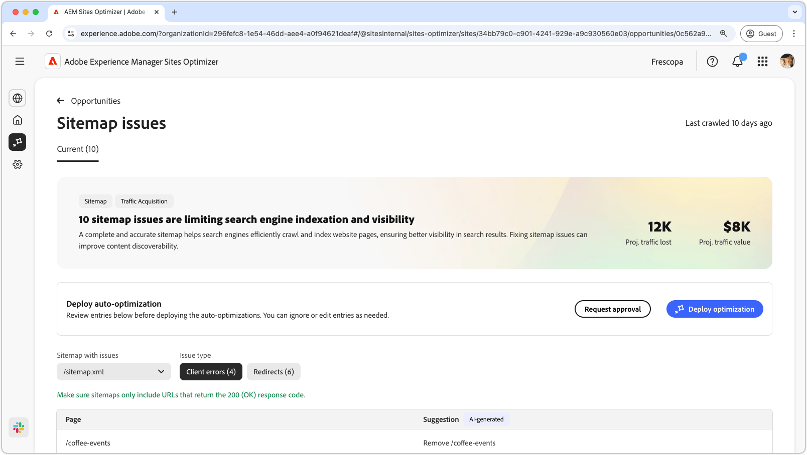
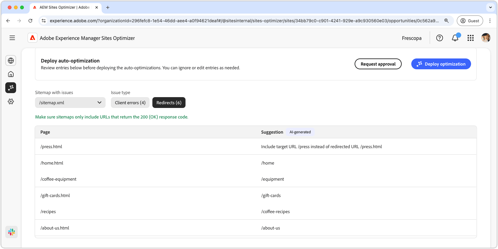

# Aanbieding voor Sitemap

{align="center"}

Met een volledige en nauwkeurige sitemap kunnen zoekprogramma&#39;s op efficiënte wijze door websitepagina&#39;s bladeren en indexeren, zodat de zoekresultaten beter zichtbaar zijn. Met de sitemapmogelijkheid worden potentiële problemen in uw sitemap geïdentificeerd. Door dit probleem op te lossen, kunt u de indexering van zoekprogramma&#39;s en de ontdekkingsmogelijkheden van inhoud op uw site aanzienlijk verbeteren.

Boven aan de pagina wordt een overzicht weergegeven met een overzicht van het probleem en de gevolgen voor uw site en bedrijf.

* **Geprojecteerd verloren verkeer** - het geschatte verkeersverlies toe te schrijven aan sitemap kwesties.
* **Geprojecteerde verkeerswaarde** - de geschatte waarde van het verloren verkeer.

## Automatische identificatie

Sitemap-problemen kunnen worden gefilterd aan de hand van de volgende criteria:

* **Sitemap met kwesties** - geanalyseerde sitemap URL die potentiële kwesties bevatten.
* **Type van Uitgave** - het type van kwestie dat in sitemap wordt geïdentificeerd:
   * **de fouten van de Cliënt** - ingangen die geen reactie van de a `200 Success` terugkeren.
   * **richt** opnieuw om - Ondeugdelijk of misconfigured richt.

>[!BEGINTABS]

>[!TAB  de fouten van de Cliënt ]

{align="center"}

Als URLs in uw sitemap deze terugkeert, kunnen de onderzoeksmotoren veronderstellen uw sitemap verouderd is of dat de pagina&#39;s per ongeluk werden verwijderd. De client geeft aan dat de aanvraag van de client (browser of crawler) ongeldig was. Veelvoorkomende zijn:

* **404 niet Gevonden** - de gevraagde pagina bestaat niet.
* **403 Verboden** - de server ontkent toegang tot de gevraagde pagina.
* **410 Gone** - de pagina werd opzettelijk verwijderd en zal niet terugkeren.
* **401 onbevoegd** - de Authentificatie wordt vereist maar verstrekt niet.

Deze fouten kunnen SEO, vooral beschadigen als de belangrijke pagina&#39;s **404 of 410** terugkeren, aangezien de onderzoeksmotoren hen kunnen ontindexeren.

Elke kwestie wordt getoond in een lijst, met de **kolom van de Pagina** identificerend de beïnvloede sitemap ingang:

* **Pagina** - URL van de sitemapingang met een kwestie.

>[!TAB richt  opnieuw]

{align="center"}

Sitemaps mogen alleen de uiteindelijke doel-URL&#39;s bevatten, niet de URL&#39;s die omleiden. Omleiding is bedoeld om gebruikers en kruiplers aan de correcte plaats te begeleiden maar kan problemen veroorzaken als misconfigured:

* **302 Gevonden (Tijdelijke Omleiding)** - kan SEO kwesties veroorzaken als verkeerd gebruikt in plaats van a **301**.
* **307 Tijdelijke Omleiding** - Gelijkaardig aan 302 maar behoudt de methode van HTTP.
* **richt Lussen opnieuw** - wanneer een pagina terug naar zich richt of tot een oneindige lijn leidt.
* **Gebroken richt** opnieuw: wanneer een omleiding tot een niet-bestaande of 4xx pagina leidt.

Elke kwestie wordt getoond in een lijst, met de **kolom van de Pagina** identificerend de beïnvloede sitemap ingang:

* **Pagina** - URL van de sitemapingang met een kwestie.

>[!ENDTABS]

## Automatisch voorstellen

Elke sitemapkwestie [ die aan de filtercriteria ](#auto-identify) voldoet is vermeld in een lijst met de volgende kolommen:

* **Pagina** - URL van de sitemapingang met een kwestie.
* **Suggestie** - de geadviseerde moeilijke situatie voor de kwestie.

Suggesties bevatten doorgaans een bijgewerkt sitepad om de sitemapvermelding te corrigeren. In sommige gevallen kunnen ze ook gedetailleerdere instructies geven, zoals het juiste omleidingsdoel opgeven.

## Automatisch optimaliseren

[!BADGE &#x200B; Ultimate &#x200B;]{type=Positive tooltip="Ultimate"}

{align="center"}

Sites Optimizer Ultimate voegt de mogelijkheid toe om automatisch geoptimaliseerde sitemaps te implementeren.

>[!BEGINTABS]

>[!TAB stel optimalisering  op]

{{auto-optimize-deploy-optimization-slack}}

>[!TAB  Goedkeuring van het Verzoek ]

{{auto-optimize-request-approval}}

>[!ENDTABS]
