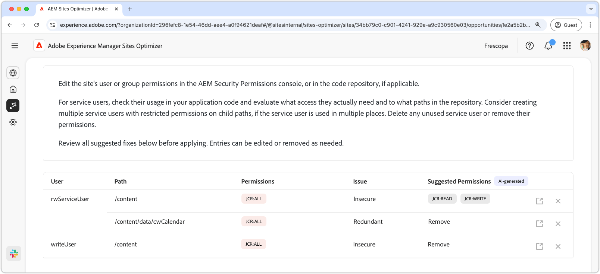

# Mogelijkheid voor webmachtigingen

{align="center"}

De mogelijkheid om websitemachtigingen te gebruiken optimaliseert websitemachtigingen, die cruciaal zijn voor het onderhouden van een veilige en beheerbare AEM-omgeving. Met deze mogelijkheid kunt u de toegangsbesturingselementen verfijnen door te ruime machtigingen (zoals `jcr:all` voor algemene paden zoals `/` of `/content` ) te verwijderen en gebruikerstoegang uit te lijnen met het beginsel van de minste bevoegdheden. Door machtigingen te stroomlijnen en redundanties te elimineren, kunt u beveiligingsrisico&#39;s verkleinen, het onderhoud verbeteren en toekomstige fouten voorkomen. Bevoegdheden controleren en bijwerken in de AEM Security Permissions Console of in uw gegevensopslagruimte. Dit zorgt ervoor dat de de dienstgebruikers slechts de toegang hebben zij werkelijk nodig hebben.

## Automatische identificatie

{align="center"}

De **eigenschap van de Toestemmingen van de Website** identificeert zich automatisch en maakt een lijst

* **Gebruiker** - de gebruikersrekening met de verdachte toestemming.
* **Weg** - gebruik de lusjes over de bovenkant om kansen door status te organiseren en te filtreren.
* **Toestemming** - de vermoedelijke toestemming.
* **Uitgave** - wijst op het type van kwestie die de toestemming beïnvloeden.

## Automatisch voorstellen

{align="center"} voor

De auto-suggestie verstrekt AI-Gegenereerde aanbevelingen op het **Voorgestelde toestemmingengebied**, toestaand u om het even welke gemarkeerde toestemmingen met veilige alternatieven te vervangen.

## Automatisch optimaliseren

[!BADGE &#x200B; Ultimate &#x200B;]{type=Positive tooltip="Ultimate"}

{align="center"}

Sites Optimizer Ultimate voegt de mogelijkheid toe om automatische optimalisatie te implementeren voor de gevonden kwetsbaarheden.

>[!BEGINTABS]

>[!TAB stel optimalisering  op]

{{auto-optimize-deploy-optimization-slack}}

>[!TAB  Goedkeuring van het Verzoek ]

{{auto-optimize-request-approval}}

>[!ENDTABS]
