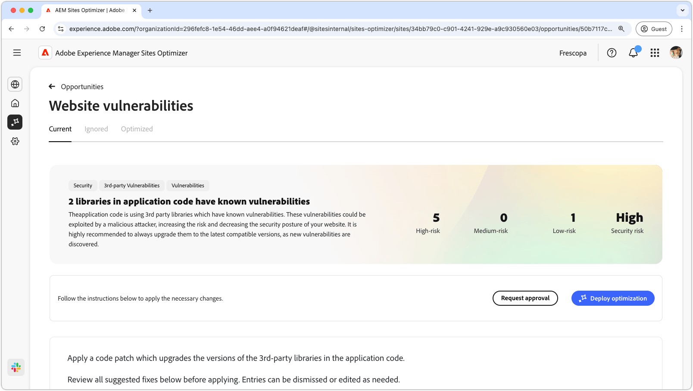
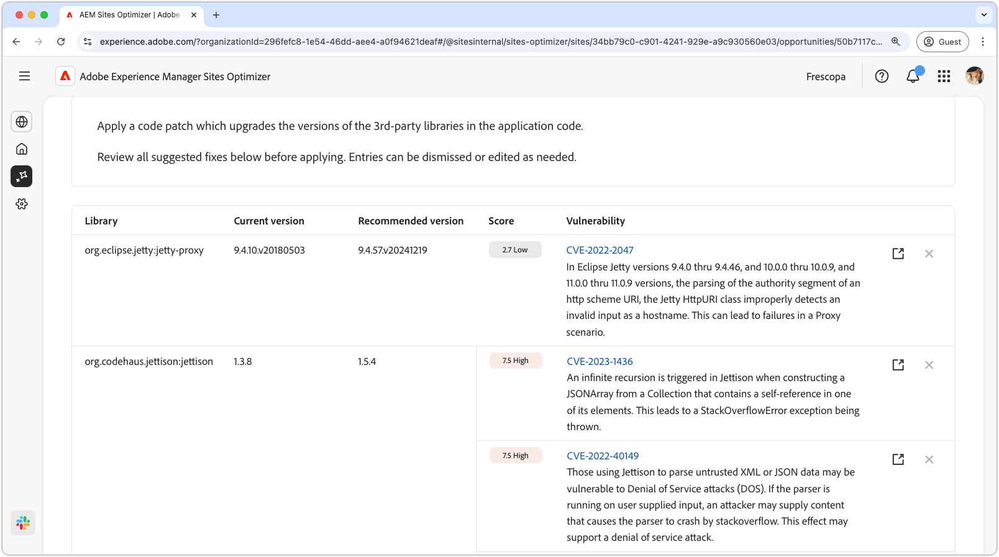
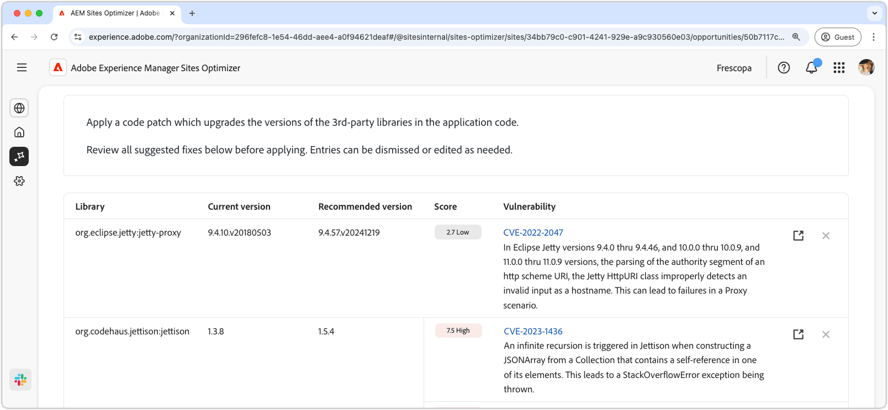
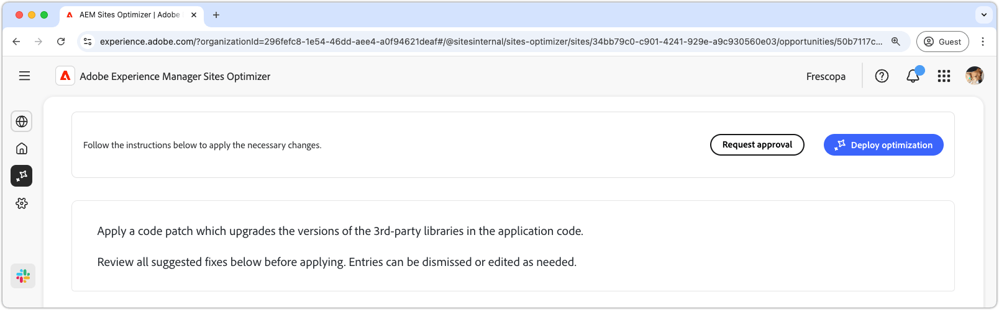

# Onmogelijkheid voor website

{align="center"}

De kwetsbaarheidskans van de website identificeert veiligheidskwetsbaarheden in de derdebibliotheken die door uw toepassingscode worden gebruikt. Kwaadwillige aanvallers misbruiken deze kwetsbaarheden, waardoor het risico toeneemt en de beveiligingsstatus van uw website afneemt.

De kans op websitekwetsbaarheden toont een overzicht boven aan de pagina, met inbegrip van het volgende:

* **Gevonden kwesties** - het aantal gevonden kwetsbaarheden, die door het veiligheidsrisico worden gecategoriseerd zij (laag, middelgroot, hoog) vertegenwoordigen.
* **Geaggregeerd veiligheidsrisico** - het algemene veiligheidsrisico aan uw website die op de kwetsbaarheid wordt gebaseerd die door de kans wordt gevonden.

## Automatische identificatie

{align="center"}

De **eigenschap van de Kans van de Kwetsbaarheid van de Kwetsbaarheid van de Website** identificeert zich automatisch en maakt een lijst van kwetsbaarheid die in derdebibliotheken wordt gevonden die door uw toepassingscode worden gebruikt. Hierin worden de volgende details gegeven:

* **Bibliotheek** - de derdebibliotheek die de kwetsbaarheid bevat. Een enkele bibliotheek kan meerdere kwetsbaarheden hebben.
* **Huidige Versie** - de versie van de bibliotheek momenteel in gebruik.
* **Geadviseerde Versie** - de gesuggereerde versie die de kwetsbaarheid oplost.
* **Score** - de strengheidsclassificatie van de kwetsbaarheid, ook samengevat bij de bovenkant van de pagina.
* **Vulnerability** - het kwetsbaarheidsherkenningsteken, een korte beschrijving, en een verbinding aan het Nationale Gegevensbestand van de Vulnerability (NVD) voor meer details. U opent de NVD-koppeling door op de id of de koppeling naast de beschrijving te klikken.

## Automatisch voorstellen

{align="center"} voor

De auto-suggestie verstrekt AI-Gegenereerde suggesties voor de **Geadviseerde versie** van een kwetsbare bibliotheek u zou moeten bevorderen aan. Elke ingang heeft a **Score** die op zijn algemene strengheid wijst, die aan de meest kritieke kwetsbaarheid helpt voorrang geven.

>[!BEGINTABS]

>[!TAB  de details van de Vulnerability ]

Elke kwetsbaarheid bevat een verbinding aan de gedetailleerde informatie in het [ Nationale Gegevensbestand van de Vulnerability (NVD) ](https://nvd.nist.gov/). Als u klikt op de kwetsbaarheidsidentificatie of het koppelingsitem rechts van de beschrijving, gaat u naar de NVD-pagina voor die kwetsbaarheid.

>[!TAB  negeer ingangen ]

U kunt items in de lijst met kwetsbaarheden negeren. Het selecteren van  verwijdert de ingang uit de lijst. De genegeerde ingangen kunnen van het **Genegeerde** lusje bij de bovenkant van de opportuniteitspagina opnieuw worden aangehaald.<!---right now it does not seem to be implemented, but the page description mentions this functionality-->

>[!ENDTABS]

## Automatisch optimaliseren

[!BADGE &#x200B; Ultimate &#x200B;]{type=Positive tooltip="Ultimate"}

{align="center"}

Sites Optimizer Ultimate voegt de mogelijkheid toe om automatische optimalisatie te implementeren voor de gevonden kwetsbaarheden.

>[!BEGINTABS]

>[!TAB stel optimalisering  op]

{{auto-optimize-deploy-optimization-slack}}

>[!TAB  Goedkeuring van het Verzoek ]

{{auto-optimize-request-approval}}

>[!ENDTABS]