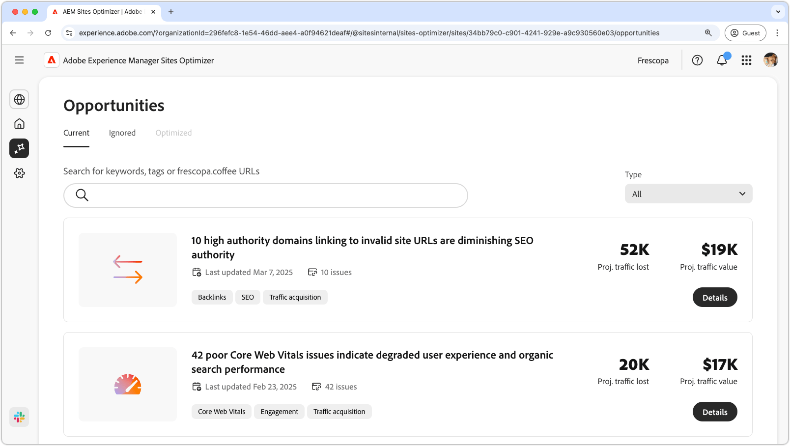

# Sites Optimizer-documentatie

{align="center"}

Welkom bij de documentatie van Sites Optimizer. Hier vindt u informatie over hoe u Sites Optimizer kunt gebruiken om uw AEM-sites te optimaliseren.

## Basisbeginselen van Siteoptimalisatie

Onderzoek de documentatie van AEM Sites Optimizer om over zeer belangrijke componenten UI, met inbegrip van het dashboard van het Huis, de configuraties van Montages, en de lijst van Kansen voor optimaliseringsinzichten te leren.

<!-- CARDS 

* ./basics.md
  {title = Basics}
  {image = ./assets/basics/card.png}
* ./opportunities/overview.md
  {title = Opportunities}
* ./settings.md
  {title = Settings}

-->
<!-- START CARDS HTML - DO NOT MODIFY BY HAND -->

    

        

            

                <figure class="image x-is-16by9">
                    
                </figure>
            

            

                

                    

                        <a href="./basics.md" target="_blank" rel="referrer" title="Basisbeginselen"> Grondbeginselen </a>
                    

                    
Leer meer over de basisbeginselen van Sites Optimizer en hoe u erin kunt navigeren.

                

                <a href="./basics.md" target="_blank" rel="referrer" class="spectrum-Button spectrum-Button--outline spectrum-Button--primary spectrum-Button--sizeM" style="align-self: flex-start; margin-top: 1rem;">
                     Leer meer 
                </a>
            

        

    

    

        

            

                <figure class="image x-is-16by9">
                    
                </figure>
            

            

                

                    

                        <a href="./opportunities/overview.md" target="_blank" rel="referrer" title="Kansen"> Kansen </a>
                    

                    
Leer meer over alle beschikbare mogelijkheden voor Siteoptimalisatie en hoe u deze kunt gebruiken om de prestaties van uw site te verbeteren.

                

                <a href="./opportunities/overview.md" target="_blank" rel="referrer" class="spectrum-Button spectrum-Button--outline spectrum-Button--primary spectrum-Button--sizeM" style="align-self: flex-start; margin-top: 1rem;">
                     Leer meer 
                </a>
            

        

    

    

        

            

                <figure class="image x-is-16by9">
                    
                </figure>
            

            

                

                    

                        <a href="./settings.md" target="_blank" rel="referrer" title="Instellingen"> Montages </a>
                    

                    
Leer hoe u Sites Optimizer-instellingen configureert en integreert met andere gereedschappen.

                

                <a href="./settings.md" target="_blank" rel="referrer" class="spectrum-Button spectrum-Button--outline spectrum-Button--primary spectrum-Button--sizeM" style="align-self: flex-start; margin-top: 1rem;">
                     Leer meer 
                </a>
            

        

    

<!-- END CARDS HTML - DO NOT MODIFY BY HAND -->

