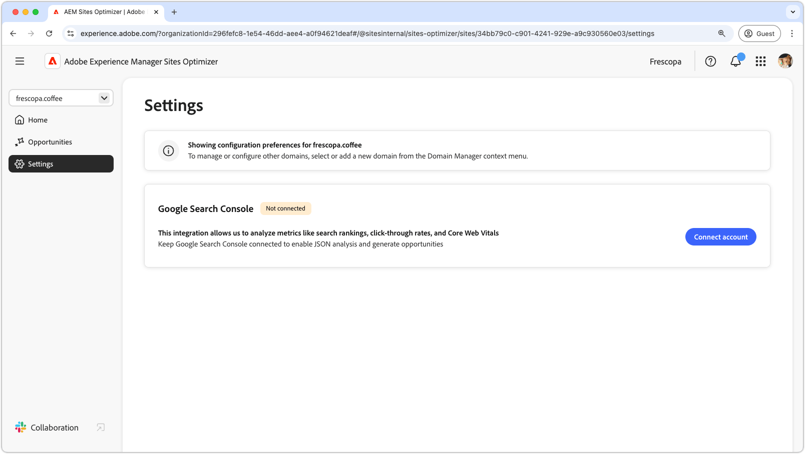
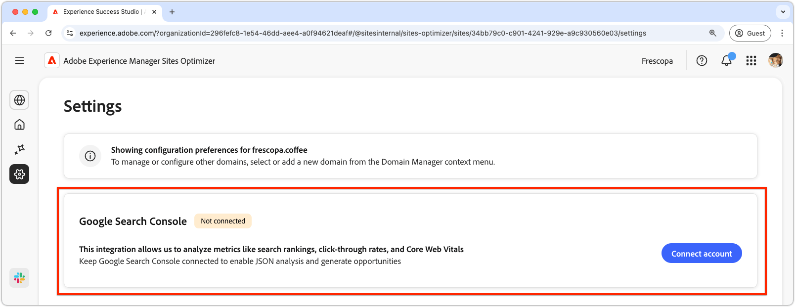

# Sites Optimizer-instellingen

{align="center"}

Instellingen voor Siteoptimalisatie vormen het centrale knooppunt voor het configureren van uw Sites Optimizer-ervaring.

## Google-zoekconsole

{align="center"}

Met de Google Search Console Settings-aansluiting in AEM Sites Optimizer kunt u belangrijke SEO-meetgegevens analyseren, zoals zoekresultaten, doorkliksnelheden en Core Web Vital. Door de Google Search Console verbonden te houden, kunt u JSON analyse gebruiken om optimalisatiemogelijkheden te ontdekken en plaatsprestaties te verbeteren.

Als u deze connector wilt instellen, moet u beschikken over toegangsgegevens met beheerdersrechten tot de Google Search Console voor het domein.
