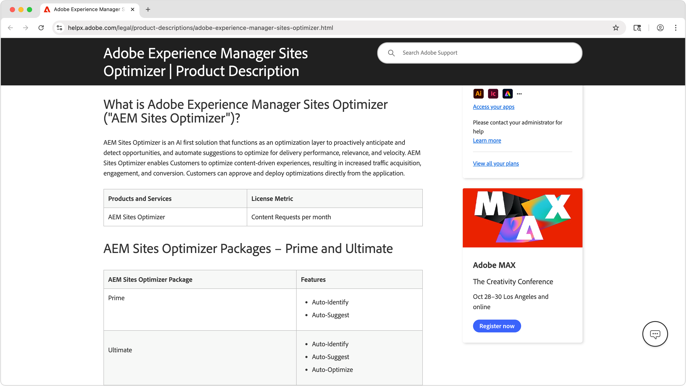
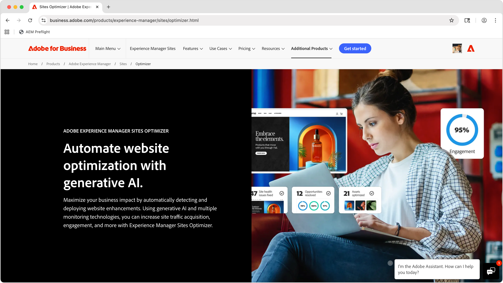

# AEM Sites Optimizer

>[!VIDEO](https://video.tv.adobe.com/v/3455085/?learn=on&enablevpops)

Adobe Experience Manager (AEM) Sites Optimizer is een cloudservice waarmee de prestaties van websites die op AEM zijn gebouwd, worden geanalyseerd en verbeterd. Sites Optimizer identificeert gebieden die verbeterd kunnen worden bij het laden van pagina&#39;s, het gebruik van componenten en de levering van inhoud. Deze functionaliteit verbetert de prestaties van uw website en verlaagt tegelijk de onderhouds- en updatekosten. Door Sites Optimizer te gebruiken, kunt u een vloeiende en betrouwbare online ervaring garanderen, die belangrijk is voor het onderhouden van betrokkenheid en conversies.

## Aan de slag met Sites Optimizer

<!-- CARDS 

* ./opportunity-types/overview.md
    * {title=Opportunity types}
    * {description = Learn about the available Site Optimizer opportunities and how to use them to improve your site's performance.}
* ./opportunity-types/preflight.md
  * {title=Preflight opportunities}
  * {description = Learn about the Preflight opportunities in Sites Optimizer and how to optimize your web pages before they're even published.}
* ./documentation/overview.md
  * {title=Documentation}
  * {description=Explore the Sites Optimizer documentation to learn about all its capabilities.}

-->
<!-- START CARDS HTML - DO NOT MODIFY BY HAND -->

    

        

            

                <figure class="image x-is-16by9">
                    
                </figure>
            

            

                

                    

                        <a href="./opportunity-types/overview.md" target="_blank" rel="referrer" title="Opportuniteitstypen"> types van Opportunity </a>
                    

                    
Leer meer over de beschikbare mogelijkheden voor Siteoptimalisatie en hoe u deze kunt gebruiken om de prestaties van uw site te verbeteren.

                

                <a href="./opportunity-types/overview.md" target="_blank" rel="referrer" class="spectrum-Button spectrum-Button--outline spectrum-Button--primary spectrum-Button--sizeM" style="align-self: flex-start; margin-top: 1rem;">
                     Leer meer 
                </a>
            

        

    

    

        

            

                <figure class="image x-is-16by9">
                    
                </figure>
            

            

                

                    

                        <a href="./documentation/overview.md" target="_blank" rel="referrer" title="Documentatie"> Documentatie </a>
                    

                    
Bekijk de documentatie van Sites Optimizer voor meer informatie over alle mogelijkheden.

                

                <a href="./documentation/overview.md" target="_blank" rel="referrer" class="spectrum-Button spectrum-Button--outline spectrum-Button--primary spectrum-Button--sizeM" style="align-self: flex-start; margin-top: 1rem;">
                     Leer meer 
                </a>
            

        

    

<!-- END CARDS HTML - DO NOT MODIFY BY HAND -->

## Meer informatie over Sites Optimizer

<!-- CARDS 
* https://helpx.adobe.com/nl/legal/product-descriptions/adobe-experience-manager-sites-optimizer.html
    {title=Packages and licensing}
    {description=Learn about AEM Sites Optimizer packages and licensing.}
    {image=./assets/home/licensing.png}
    {target=_blank}
    {cta=Learn more}
* https://business.adobe.com/products/experience-manager/sites/optimizer.html
    {title=Explore the capabilities of AEM Sites Optimizer}
    {description=Learn what AEM Site Optimizer can do for your company.}
    {image=./assets/home/business-adobe-com.png}
    {target=_blank}
    {cta=Learn more}
-->
<!-- START CARDS HTML - DO NOT MODIFY BY HAND -->

    

        

            

                <figure class="image x-is-16by9">
                    
                </figure>
            

            

                

                    

                        <a href="https://helpx.adobe.com/nl/legal/product-descriptions/adobe-experience-manager-sites-optimizer.html" target="_blank" rel="referrer" title="Pakketten en licenties"> Pakketten en verlenen van vergunningen </a>
                    

                    
Meer informatie over AEM Sites Optimizer-pakketten en -licenties.

                

                <a href="https://helpx.adobe.com/nl/legal/product-descriptions/adobe-experience-manager-sites-optimizer.html" target="_blank" rel="referrer" class="spectrum-Button spectrum-Button--outline spectrum-Button--primary spectrum-Button--sizeM" style="align-self: flex-start; margin-top: 1rem;">
                     Leer meer 
                </a>
            

        

    

    

        

            

                <figure class="image x-is-16by9">
                    
                </figure>
            

            

                

                    

                        <a href="https://business.adobe.com/products/experience-manager/sites/optimizer.html" target="_blank" rel="referrer" title="De mogelijkheden van AEM Sites Optimizer verkennen"> Onderzoek de mogelijkheden van AEM Sites Optimizer </a>
                    

                    
Ontdek wat AEM Site Optimizer kan doen voor uw bedrijf.

                

                <a href="https://business.adobe.com/products/experience-manager/sites/optimizer.html" target="_blank" rel="referrer" class="spectrum-Button spectrum-Button--outline spectrum-Button--primary spectrum-Button--sizeM" style="align-self: flex-start; margin-top: 1rem;">
                     Leer meer 
                </a>
            

        

    

<!-- END CARDS HTML - DO NOT MODIFY BY HAND -->
