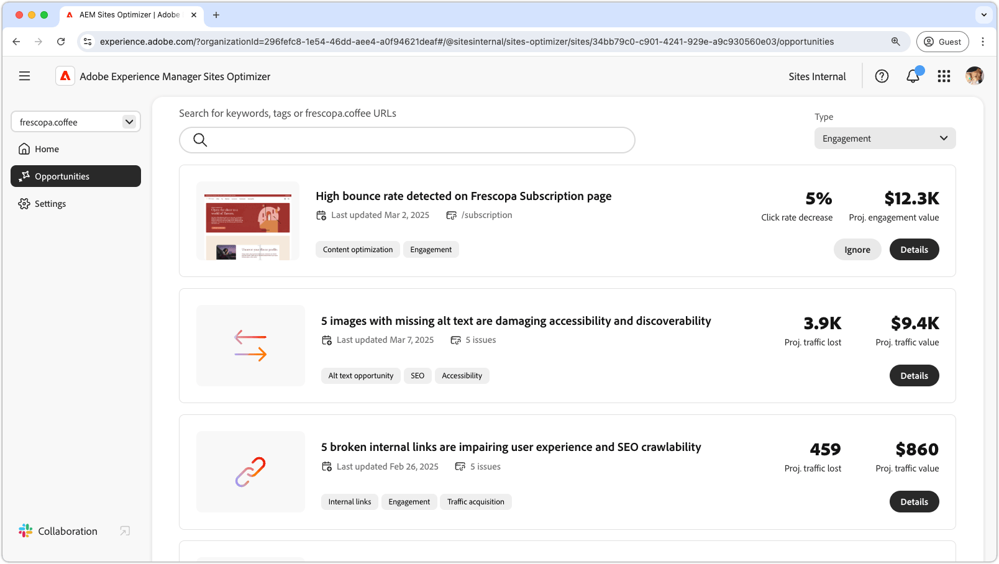

# Betrokkenheidskansen

{align="center"}

Betrokkenheidsmogelijkheden in AEM Sites Optimizer zijn van cruciaal belang voor het verbeteren van digitale ervaringen door gebruikers inzicht te geven in de manier waarop ze met webpagina&#39;s werken. Door gebieden voor verbetering te identificeren - zoals toegankelijkheidskwesties, gebroken interne verbindingen, hoge stuittarieven, en ontbrekende alt tekst - kunnen de marketers en inhoudsauteurs hun plaatsen voor betere prestaties en gebruikersbetrokkenheid optimaliseren. Deze kansen helpen ervoor zorgen dat de inhoud effectief, ontdekkbaar, en dwingend is, uiteindelijk drijvende hogere omzettingen en een naadloze klantenreis. Met AEM Sites Optimizer-aanbevelingen kunnen teams hun digitale strategie voortdurend verfijnen en op grote schaal ervaringen met hoge impact bieden.

## Kansen

<!-- CARDS

* ../documentation/opportunities/accessibility-issues.md
  {title=Accessibility issues}
  {image=../assets/common/card-puzzle.png}
* ../documentation/opportunities//broken-internal-links.md
  {title=Broken internal links}
  {image=../assets/common/card-link.png}
* ../documentation/opportunities//high-bounce-rate.md
  {title=High bounce rate}
  {image=../assets/common/card-arrows.png}
* ../documentation/opportunities/missing-alt-text.md  
  {title=Missing alt text}
  {image=../assets/common/card-arrows.png}

-->
<!-- START CARDS HTML - DO NOT MODIFY BY HAND -->

    

        

            

                <figure class="image x-is-16by9">
                    
                </figure>
            

            

                

                    

                        <a href="../documentation/opportunities/accessibility-issues.md" target="_blank" rel="referrer" title="Toegankelijkheidsproblemen"> de kwesties van de Toegankelijkheid </a>
                    

                    
Leer meer over de mogelijkheden voor toegankelijkheidsproblemen en hoe u deze kunt gebruiken om de beveiliging van uw website te verbeteren.

                

                <a href="../documentation/opportunities/accessibility-issues.md" target="_blank" rel="referrer" class="spectrum-Button spectrum-Button--outline spectrum-Button--primary spectrum-Button--sizeM" style="align-self: flex-start; margin-top: 1rem;">
                     Leer meer 
                </a>
            

        

    

    

        

            

                <figure class="image x-is-16by9">
                    
                </figure>
            

            

                

                    

                        <a href="../documentation/opportunities//broken-internal-links.md" target="_blank" rel="referrer" title="Verbroken interne koppelingen"> Gebroken interne verbindingen </a>
                    

                    
Meer informatie over de kans op verbroken koppelingen en hoe u deze kunt gebruiken om de betrokkenheid op uw website te verbeteren.

                

                <a href="../documentation/opportunities//broken-internal-links.md" target="_blank" rel="referrer" class="spectrum-Button spectrum-Button--outline spectrum-Button--primary spectrum-Button--sizeM" style="align-self: flex-start; margin-top: 1rem;">
                     Leer meer 
                </a>
            

        

    

    

        

            

                <figure class="image x-is-16by9">
                    
                </figure>
            

            

                

                    

                        <a href="../documentation/opportunities//high-bounce-rate.md" target="_blank" rel="referrer" title="Hoge stuitsnelheid"> Hoog stuittarief </a>
                    

                    
Meer informatie over de lage weergavemogelijkheid en hoe u deze kunt gebruiken om de betrokkenheid van formulieren op uw website te verbeteren.

                

                <a href="../documentation/opportunities//high-bounce-rate.md" target="_blank" rel="referrer" class="spectrum-Button spectrum-Button--outline spectrum-Button--primary spectrum-Button--sizeM" style="align-self: flex-start; margin-top: 1rem;">
                     Leer meer 
                </a>
            

        

    

    

        

            

                <figure class="image x-is-16by9">
                    
                </figure>
            

            

                

                    

                        <a href="../documentation/opportunities/missing-alt-text.md" target="_blank" rel="referrer" title="Ontbrekende alt-tekst"> Ontbrekende alt tekst </a>
                    

                    
Leer meer over de ontbrekende alternatieve tekstmogelijkheid en hoe u deze kunt gebruiken om de betrokkenheid op uw website te verbeteren.

                

                <a href="../documentation/opportunities/missing-alt-text.md" target="_blank" rel="referrer" class="spectrum-Button spectrum-Button--outline spectrum-Button--primary spectrum-Button--sizeM" style="align-self: flex-start; margin-top: 1rem;">
                     Leer meer 
                </a>
            

        

    

<!-- END CARDS HTML - DO NOT MODIFY BY HAND -->
