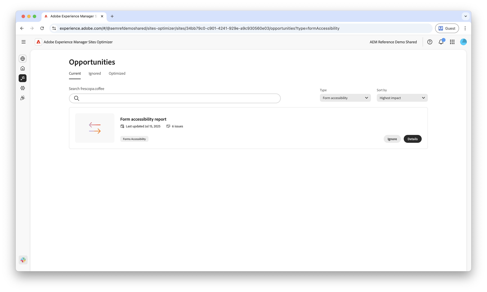

# Toegankelijkheidsmogelijkheden van Forms

 De Forms-optimalisatiefunctie is beschikbaar in het kader van een programma voor vroege toegang. U kunt vanaf uw officiële e-mailadres naar aem-forms-ea@adobe.com schrijven om deel te nemen aan het vroege toegangsprogramma en toegang tot de mogelijkheden te vragen. 

{align="center"}

Toegankelijkheidsmogelijkheden van Forms zijn van essentieel belang voor het verbeteren van gebruikersinteracties en het verhogen van de conversies. Als u uw formulieren controleert op naleving van de Web Content Accessibility Guidelines (WCAG), kunt u ervoor zorgen dat gebruikers met een visuele, auditieve, cognitieve en motorische handicap een inclusieve ervaring hebben. Deze functionaliteit voldoet niet alleen aan ethische en wettelijke vereisten, maar verbetert ook de voltooiingscijfers en vergroot uw publiek, wat resulteert in een betere gebruikerservaring en sterkere bedrijfsresultaten.

## Kansen

<!-- CARDS
 
* ../documentation/opportunities/low-views.md
  {title=Low views}
  {image=../assets/common/card-bag.png}
* ../documentation/opportunities/low-conversions.md
  {title=Low conversions}
  {image=../assets/common/card-bag.png}

--->
<!-- START CARDS HTML - DO NOT MODIFY BY HAND -->

    

        

            

                <figure class="image x-is-16by9">
                    
                </figure>
            

            

                

                    

                        <a href="../documentation/opportunities/forms-accessibility-issues.md" target="_blank" rel="referrer" title="Toegankelijkheidsproblemen in Forms"> de Toegankelijkheidskwesties van Forms </a>
                    

                    
Leer meer over de toegankelijkheidsproblemen van formulieren en hoe u deze kunt gebruiken om de betrokkenheid van formulieren op uw website te verbeteren.

                

                <a href="../documentation/opportunities/forms-accessibility-issues.md" target="_blank" rel="referrer" class="spectrum-Button spectrum-Button--outline spectrum-Button--primary spectrum-Button--sizeM" style="align-self: flex-start; margin-top: 1rem;">
                     Leer meer 
                </a>
            

        

    

<!-- END CARDS HTML - DO NOT MODIFY BY HAND -->
