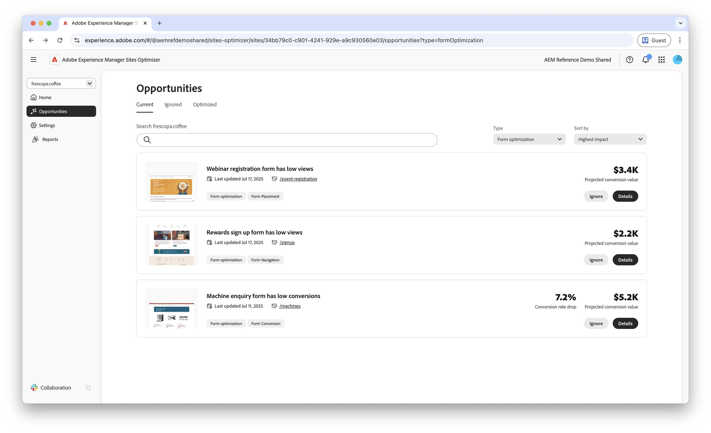

# Optimalisatiemogelijkheden voor formulieren

{align="center"}

Optimalisatie van formulieren in AEM Sites Optimizer is essentieel voor het verbeteren van gebruikersinteracties en het maximaliseren van conversies. Door gebieden voor verbetering aan te wijzen—zoals lage meningen en lage omzettingen van vorm—kunnen de teams vormontwerp, plaatsing, en inhoud verfijnen om overeenkomst te verbeteren. Geoptimaliseerde formulieren zorgen voor een naadloze gebruikerservaring, waardoor het voor bezoekers gemakkelijker wordt om handelingen uit te voeren en bedrijfsresultaten te sturen. Door AEM Sites Optimizer-inzichten te gebruiken, kunnen marketers voortdurend gebieden voor verbetering identificeren, waardoor de effectiviteit uiteindelijk toeneemt en de algehele prestaties van de site worden verbeterd.

## Kansen

<!-- CARDS
 
* ../documentation/opportunities/low-views.md
  {title=Low views}
  {image=../assets/common/card-bag.png}
* ../documentation/opportunities/low-conversions.md
  {title=Low conversions}
  {image=../assets/common/card-bag.png}

--->
<!-- START CARDS HTML - DO NOT MODIFY BY HAND -->

    

        

            

                <figure class="image x-is-16by9">
                    
                </figure>
            

            

                

                    

                        <a href="../documentation/opportunities/low-views.md" target="_blank" rel="referrer" title="Lage weergaven"> Lage meningen </a>
                    

                    
Meer informatie over de lage weergavemogelijkheid en hoe u deze kunt gebruiken om de betrokkenheid van formulieren op uw website te verbeteren.

                

                <a href="../documentation/opportunities/low-views.md" target="_blank" rel="referrer" class="spectrum-Button spectrum-Button--outline spectrum-Button--primary spectrum-Button--sizeM" style="align-self: flex-start; margin-top: 1rem;">
                     Leer meer 
                </a>
            

        

    

    

        

            

                <figure class="image x-is-16by9">
                    
                </figure>
            

            

                

                    

                        <a href="../documentation/opportunities/low-conversions.md" target="_blank" rel="referrer" title="Lage omzettingen"> Lage omzettingen </a>
                    

                    
Leer meer over de lage conversiemogelijkheid en hoe u deze kunt gebruiken om de betrokkenheid van formulieren op uw website te verbeteren.

                

                <a href="../documentation/opportunities/low-conversions.md" target="_blank" rel="referrer" class="spectrum-Button spectrum-Button--outline spectrum-Button--primary spectrum-Button--sizeM" style="align-self: flex-start; margin-top: 1rem;">
                     Leer meer 
                </a>
            

        

    

<!-- END CARDS HTML - DO NOT MODIFY BY HAND -->
