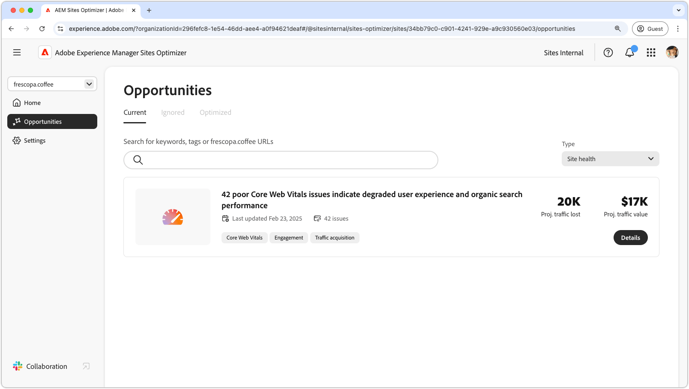

# Opportuniteitstypen

{align="center"}

AEM Sites Optimizer biedt waardevolle inzichten en aanbevelingen om u te helpen de prestaties, bruikbaarheid en beveiliging van uw website te verbeteren. Deze inzichten zijn gegroepeerd in de volgende belangrijke opportuniteitsgebieden:

* Betrokkenheid
* Verkeersverwerving
* Beveiligingstelling
* Sitegezondheid

Elke categorie markeert een andere manier om uw site te verbeteren. Eén categorie kan de interactie tussen bezoekers verhogen. Een andere kan de ontdekkingsmogelijkheden verbeteren. Anderen richten zich op het versterken van de veiligheid of het handhaven van plaatsstabiliteit.

Het gebruik van deze mogelijkheden verbetert de gebruikerservaring, trekt het juiste publiek aan, en houdt uw plaats veilig en betrouwbaar. Het verbeteren van de betrokkenheid en het aantrekken van verkeer drijft interactie en zichtbaarheid, terwijl een sterke post van de Veiligheid en de gezondheid van de plaats helpen vertrouwen en stabiliteit verzekeren.  Verken de onderstaande koppelingen om mogelijkheden per categorie te bekijken en manieren te vinden om uw site te verbeteren.

## Typen opportuniteiten

<!-- CARDS 

* ./engagement.md
   { title = Engagement }
* ./security-posture.md
   { title = Security posture }
* ./site-health.md
   { title = Site health }
* ./traffic-acquisition.md
   { title = Traffic acquisition }

-->
<!-- START CARDS HTML - DO NOT MODIFY BY HAND -->

    

        

            

                <figure class="image x-is-16by9">
                    
                </figure>
            

            

                

                    

                        <a href="./engagement.md" target="_blank" rel="referrer" title="Betrokkenheid"> Betrokkenheid </a>
                    

                    
Leer hoe u de betrokkenheid bij Sites Optimizer kunt verbeteren.

                

                <a href="./engagement.md" target="_blank" rel="referrer" class="spectrum-Button spectrum-Button--outline spectrum-Button--primary spectrum-Button--sizeM" style="align-self: flex-start; margin-top: 1rem;">
                     Leer meer 
                </a>
            

        

    

    

        

            

                <figure class="image x-is-16by9">
                    
                </figure>
            

            

                

                    

                        <a href="./security-posture.md" target="_blank" rel="referrer" title="Beveiligingspositie"> Positie van de Veiligheid </a>
                    

                    
Leer hoe u de beveiliging van uw site kunt verbeteren met Sites Optimizer.

                

                <a href="./security-posture.md" target="_blank" rel="referrer" class="spectrum-Button spectrum-Button--outline spectrum-Button--primary spectrum-Button--sizeM" style="align-self: flex-start; margin-top: 1rem;">
                     Leer meer 
                </a>
            

        

    

    

        

            

                <figure class="image x-is-16by9">
                    
                </figure>
            

            

                

                    

                        <a href="./site-health.md" target="_blank" rel="referrer" title="Gezondheid van site"> gezondheid van de Plaats </a>
                    

                    
Leer hoe u de gezondheid van uw site kunt verbeteren met Sites Optimizer.

                

                <a href="./site-health.md" target="_blank" rel="referrer" class="spectrum-Button spectrum-Button--outline spectrum-Button--primary spectrum-Button--sizeM" style="align-self: flex-start; margin-top: 1rem;">
                     Leer meer 
                </a>
            

        

    

    

        

            

                <figure class="image x-is-16by9">
                    
                </figure>
            

            

                

                    

                        <a href="./traffic-acquisition.md" target="_blank" rel="referrer" title="Verkeersverwerving"> de aanwinst van het Verkeer </a>
                    

                    
Leer hoe te om verkeersaanwinst met Sites Optimizer te verhogen.

                

                <a href="./traffic-acquisition.md" target="_blank" rel="referrer" class="spectrum-Button spectrum-Button--outline spectrum-Button--primary spectrum-Button--sizeM" style="align-self: flex-start; margin-top: 1rem;">
                     Leer meer 
                </a>
            

        

    

<!-- END CARDS HTML - DO NOT MODIFY BY HAND -->
