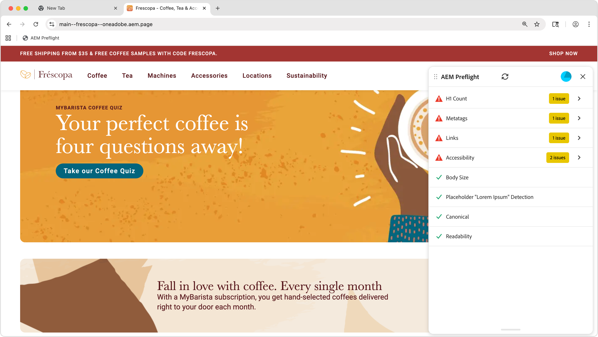

# Preflight-mogelijkheden

{align="center"}

<span class="preview"> Preflight van AEM Sites Optimizer analyseert de technische en prestatiesgegevens van uw pagina en voorziet en ontdekt kansen alvorens het wordt gepubliceerd. Het gebruikt generatieve AI om optimalisaties voor te stellen.</span>

## Kansen

<!-- CARDS

* ../documentation/opportunities/invalid-or-missing-metadata.md
  {title=Canonical}
  {image=../assets/common/card-link.png}
* ../documentation/opportunities/broken-internal-links.md
  {title=Broken Internal Links}
  {image=../assets/common/card-link.png}
* ../documentation/opportunities/invalid-or-missing-metadata.md
  {title=Metatags}
  {image=../assets/common/card-code.png}
* ../documentation/opportunities/invalid-or-missing-metadata.md
  {title=H1 count}
  {image=../assets/common/card-code.png}
* ../documentation/opportunities/accessibility-issues.md
  {title=Accessibility}
  {image=../assets/common/card-puzzle.png}

-->
<!-- START CARDS HTML - DO NOT MODIFY BY HAND -->
<div class="columns">
    <div class="column is-half-tablet is-half-desktop is-one-third-widescreen" aria-label="Canonical">
        <div class="card" style="height: 100%; display: flex; flex-direction: column; height: 100%;">
            <div class="card-image">
                <figure class="image x-is-16by9">
                    <a href="../documentation/opportunities/invalid-or-missing-metadata.md" title="Canonical" target="_blank" rel="referrer">
                        
                    </a>
                </figure>
            </div>
            <div class="card-content is-padded-small" style="display: flex; flex-direction: column; flex-grow: 1; justify-content: space-between;">
                <div class="top-card-content">
                    <p class="headline is-size-6 has-text-weight-bold">
                        <a href="../documentation/opportunities/invalid-or-missing-metadata.md" target="_blank" rel="referrer" title="Canonical"> Canonical </a>
                    </p>
                    <p class="is-size-6">Leer meer over de kanonische mogelijkheid en hoe u deze kunt gebruiken om SEO te verbeteren en dubbele inhoudsproblemen te voorkomen.</p>
                </div>
                <a href="../documentation/opportunities/invalid-or-missing-metadata.md" target="_blank" rel="referrer" class="spectrum-Button spectrum-Button--outline spectrum-Button--primary spectrum-Button--sizeM" style="align-self: flex-start; margin-top: 1rem;">
                    <span class="spectrum-Button-label has-no-wrap has-text-weight-bold"> Leer meer </span>
                </a>
            </div>
        </div>
    </div>
    <div class="column is-half-tablet is-half-desktop is-one-third-widescreen" aria-label="Broken Internal Links">
        <div class="card" style="height: 100%; display: flex; flex-direction: column; height: 100%;">
            <div class="card-image">
                <figure class="image x-is-16by9">
                    <a href="../documentation/opportunities/broken-internal-links.md" title="Verbroken interne koppelingen" target="_blank" rel="referrer">
                        
                    </a>
                </figure>
            </div>
            <div class="card-content is-padded-small" style="display: flex; flex-direction: column; flex-grow: 1; justify-content: space-between;">
                <div class="top-card-content">
                    <p class="headline is-size-6 has-text-weight-bold">
                        <a href="../documentation/opportunities/broken-internal-links.md" target="_blank" rel="referrer" title="Verbroken interne koppelingen"> gebroken Interne Verbindingen </a>
                    </p>
                    <p class="is-size-6">Leer meer over de verbroken mogelijkheid voor interne koppelingen en hoe u deze kunt gebruiken om verbroken of problematische koppelingen op uw website te identificeren en te herstellen.</p>
                </div>
                <a href="../documentation/opportunities/broken-internal-links.md" target="_blank" rel="referrer" class="spectrum-Button spectrum-Button--outline spectrum-Button--primary spectrum-Button--sizeM" style="align-self: flex-start; margin-top: 1rem;">
                    <span class="spectrum-Button-label has-no-wrap has-text-weight-bold"> Leer meer </span>
                </a>
            </div>
        </div>
    </div>
    <div class="column is-half-tablet is-half-desktop is-one-third-widescreen" aria-label="Metatags">
        <div class="card" style="height: 100%; display: flex; flex-direction: column; height: 100%;">
            <div class="card-image">
                <figure class="image x-is-16by9">
                    <a href="../documentation/opportunities/invalid-or-missing-metadata.md" title="Metatags" target="_blank" rel="referrer">
                        
                    </a>
                </figure>
            </div>
            <div class="card-content is-padded-small" style="display: flex; flex-direction: column; flex-grow: 1; justify-content: space-between;">
                <div class="top-card-content">
                    <p class="headline is-size-6 has-text-weight-bold">
                        <a href="../documentation/opportunities/invalid-or-missing-metadata.md" target="_blank" rel="referrer" title="Metatags"> Metatags </a>
                    </p>
                    <p class="is-size-6">Leer meer over de kans op metagegevens en hoe u deze kunt gebruiken om de metagegevens van uw pagina te optimaliseren voor betere SEO-prestaties.</p>
                </div>
                <a href="../documentation/opportunities/invalid-or-missing-metadata.md" target="_blank" rel="referrer" class="spectrum-Button spectrum-Button--outline spectrum-Button--primary spectrum-Button--sizeM" style="align-self: flex-start; margin-top: 1rem;">
                    <span class="spectrum-Button-label has-no-wrap has-text-weight-bold"> Leer meer </span>
                </a>
            </div>
        </div>
    </div>
    <div class="column is-half-tablet is-half-desktop is-one-third-widescreen" aria-label="H1 count">
        <div class="card" style="height: 100%; display: flex; flex-direction: column; height: 100%;">
            <div class="card-image">
                <figure class="image x-is-16by9">
                    <a href="../documentation/opportunities/invalid-or-missing-metadata.md" title="Aantal H1" target="_blank" rel="referrer">
                        
                    </a>
                </figure>
            </div>
            <div class="card-content is-padded-small" style="display: flex; flex-direction: column; flex-grow: 1; justify-content: space-between;">
                <div class="top-card-content">
                    <p class="headline is-size-6 has-text-weight-bold">
                        <a href="../documentation/opportunities/invalid-or-missing-metadata.md" target="_blank" rel="referrer" title="Aantal H1"> H1 aantal </a>
                    </p>
                    <p class="is-size-6">Leer over de kans van de telling H1 en hoe te om het te gebruiken om juiste kopstructuur en SEO optimalisering te verzekeren.</p>
                </div>
                <a href="../documentation/opportunities/invalid-or-missing-metadata.md" target="_blank" rel="referrer" class="spectrum-Button spectrum-Button--outline spectrum-Button--primary spectrum-Button--sizeM" style="align-self: flex-start; margin-top: 1rem;">
                    <span class="spectrum-Button-label has-no-wrap has-text-weight-bold"> Leer meer </span>
                </a>
            </div>
        </div>
    </div>
    <div class="column is-half-tablet is-half-desktop is-one-third-widescreen" aria-label="Accessibility">
        <div class="card" style="height: 100%; display: flex; flex-direction: column; height: 100%;">
            <div class="card-image">
                <figure class="image x-is-16by9">
                    <a href="../documentation/opportunities/accessibility-issues.md" title="Toegankelijkheid" target="_blank" rel="referrer">
                        
                    </a>
                </figure>
            </div>
            <div class="card-content is-padded-small" style="display: flex; flex-direction: column; flex-grow: 1; justify-content: space-between;">
                <div class="top-card-content">
                    <p class="headline is-size-6 has-text-weight-bold">
                        <a href="../documentation/opportunities/accessibility-issues.md" target="_blank" rel="referrer" title="Toegankelijkheid"> Toegankelijkheid </a>
                    </p>
                    <p class="is-size-6">Leer meer over de toegankelijkheidsmogelijkheden en hoe u deze kunt gebruiken om ervoor te zorgen dat uw website toegankelijk is voor alle gebruikers.</p>
                </div>
                <a href="../documentation/opportunities/accessibility-issues.md" target="_blank" rel="referrer" class="spectrum-Button spectrum-Button--outline spectrum-Button--primary spectrum-Button--sizeM" style="align-self: flex-start; margin-top: 1rem;">
                    <span class="spectrum-Button-label has-no-wrap has-text-weight-bold"> Leer meer </span>
                </a>
            </div>
        </div>
    </div>

</div>
<!-- END CARDS HTML - DO NOT MODIFY BY HAND -->

## Instellen

### Universal Editor instellen

1. Ga naar de Extension Manager via de URL: https://experience.adobe.com/#/@org/aem/extension-manager/universal-editor
2. Selecteer de Preflight-extensie van AEM Sites Optimizer en schakel het selectievakje in
3. Het team van AEM zal de uitbreiding voor uw organisatie toelaten
4. Als dat is gebeurd, opent u een pagina in de Universal Editor, bijvoorbeeld: https://author-p12345-e123456.adobeaemcloud.com/ui#/@org/aem/universal-editor/canvas/author-p12345-e123456.adobeaemcloud.com/content/site/subscription.html
5. De extensie Preflight is zichtbaar in de zijspoor
6. Als u vanaf de zijbalk op de Preflight-extensie klikt, wordt de Preflight-controle voor de huidige pagina gestart

### Voorvertoning op basis van document instellen

#### Stap 1: Sidekick inschakelen met Preflight-knop

Voeg de volgende configuratie aan `/tools/sidekick/config.json` in uw bewaarplaats GitHub toe:

```json
{
  "plugins": [
    {
      "id": "preflight",
      "titleI18n": {
        "en": "Preflight"
      },
      "environments": ["preview"],
      "event": "preflight"
    }
  ]
}
```

#### Stap 2: Maak het Sidekick Integration-script

Maak `/tools/sidekick/aem-sites-optimizer-preflight.js` met de volgende inhoud:

```javascript
(function () {
  let isAEMSitesOptimizerPreflightAppLoaded = false;
  function loadAEMSitesOptimizerPreflightApp() {
    const script = document.createElement('script');
    script.src = 'https://experience.adobe.com/solutions/OneAdobe-aem-sites-optimizer-preflight-mfe/static-assets/resources/sidekick/client.js?source=plugin';
    script.onload = function () {
      isAEMSitesOptimizerPreflightAppLoaded = true;
    };
    script.onerror = function () {
      console.error('Error loading AEMSitesOptimizerPreflightApp.');
    };
    document.head.appendChild(script);
  }

  function handlePluginButtonClick() {
    if (!isAEMSitesOptimizerPreflightAppLoaded) {
      loadAEMSitesOptimizerPreflightApp();
    }
  }

  // Sidekick V1 extension support
  const sidekick = document.querySelector('helix-sidekick');
  if (sidekick) {
    sidekick.addEventListener('custom:preflight', handlePluginButtonClick);
  } else {
    document.addEventListener('sidekick-ready', () => {
      document.querySelector('helix-sidekick')
        .addEventListener('custom:preflight', handlePluginButtonClick);
    }, { once: true });
  }

  // Sidekick V2 extension support
  const sidekickV2 = document.querySelector('aem-sidekick');
  if (sidekickV2) {
    sidekickV2.addEventListener('custom:preflight', handlePluginButtonClick);
  } else {
    document.addEventListener('sidekick-ready', () => {
      document.querySelector('aem-sidekick')
        .addEventListener('custom:preflight', handlePluginButtonClick);
    }, { once: true });
  }
}());
```

#### Stap 3: Scriptbestand bijwerken

Voeg de volgende importinstructie toe aan de functie `loadLazy()` in `/scripts/scripts.js` voor voorbeeld-URL&#39;s, zoals hieronder wordt getoond:

```javascript
if (window.location.href.includes('.aem.page')) {
   import('../tools/sidekick/aem-sites-optimizer-preflight.js');
}
```

De knop Preflight moet nu zichtbaar zijn in Sidekick.

#### Stap 4: De controle uitvoeren

Open de voorvertoning-URL (*.aem.page) van de gecontroleerde pagina. Klik op de knop Preflight vanuit Sidekick.

### AEM Cloud Service Setup

U kunt de optie voor bladwijzers gebruiken om Preflight te testen op pagina-editors en Sandbox-omgevingen van AEM Cloud Service.

<!-- Drag the button below to your Bookmarks Bar to get started. -->

Pers **Ctrl+Shift+B** (Vensters) of **Cmd+Shift+B** (Mac) om uw bar van Bladwijzers te tonen. Klik met de rechtermuisknop op de bladwijzers en selecteer Nieuwe pagina of Bladwijzer toevoegen. Kopieer in het adresveld de onderstaande code.

<!-- **Drag this link to your Bookmarks Bar:**

<a href="javascript:(function(){const script=document.createElement('script');script.src='https://experience.adobe.com/solutions/OneAdobe-aem-sites-optimizer-preflight-mfe/static-assets/resources/sidekick/client.js?source=bookmarklet&target-source=aem-cloud-service';document.head.appendChild(script);})();">Preflight</a> -->

**Exemplaar deze code en creeer een nieuwe referentie:**

```
javascript:(function(){const script=document.createElement('script');script.src='https://experience.adobe.com/solutions/OneAdobe-aem-sites-optimizer-preflight-mfe/static-assets/resources/sidekick/client.js?source=bookmarklet&target-source=aem-cloud-service';document.head.appendChild(script);})();
```

Nadat de bladwijzer is toegevoegd, opent u de URL van de voorvertoning (*.aem.page) van de gecontroleerde pagina. Klik op de Preflight-bladwijzer om de Preflight-controle te starten.

## Aanbevolen procedures

Houd rekening met het volgende wanneer u Preflight gebruikt:

* Voer Preflight-audits uit op alle pagina&#39;s in de testfase of in de voorvertoning voordat u ze publiceert.
* Pas eerst problemen met een hoog effect aan (verbroken koppelingen, ontbrekende H1-tags, onveilige koppelingen).
* Verificatie inschakelen voor beveiligde staging-omgevingen.
* Bekijk en implementeer suggesties voor meta-tags voor betere SEO-prestaties.
