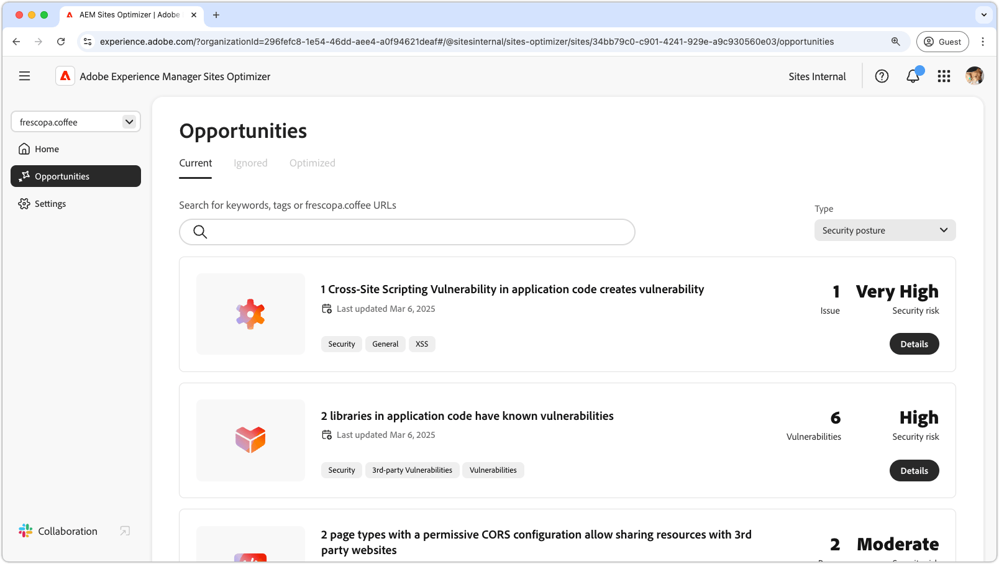

# Beveiligingsposteringsmogelijkheden

{align="center"}

Het handhaven van een sterke veiligheidshulp in AEM Sites Optimizer is essentieel voor het beschermen van digitale ervaringen en gebruikersgegevens. Door mogelijkheden voor verbetering-zoals configuratie CORS, dwars-plaats scripting, websitetoestemmingen, en website kwetsbaarheid-teams te identificeren kunnen potentiële veiligheidsrisico&#39;s proactively richten en naleving van beste praktijken verzekeren. Versterking van de beveiligingsmaatregelen beschermt niet alleen gevoelige informatie, maar vergroot ook het vertrouwen van de gebruiker en de betrouwbaarheid van de site. Door gebruik te maken van AEM Sites Optimizer-inzichten kunnen organisaties hun beveiligingsstandpunt voortdurend bewaken en verbeteren, risico&#39;s beperken en een veilige digitale omgeving handhaven.

## Kansen

<!-- CARDS

* ../documentation/opportunities/cors-configuration.md
  {title=CORS configuration}
  {image=../assets/common/card-code.png}
* ../documentation/opportunities/cross-site-scripting.md
  {title=Cross-site scripting}
  {image=../assets/common/card-gear.png}
* ../documentation/opportunities/website-permissions.md  
  {title=Website permissions}
  {image=../assets/common/card-people.png}
* ../documentation/opportunities//website-vulnerabilities.md
  {title=Website vulnerabilities}
  {image=../assets/common/card-puzzle.png}

-->
<!-- START CARDS HTML - DO NOT MODIFY BY HAND -->

    

        

            

                <figure class="image x-is-16by9">
                    
                </figure>
            

            

                

                    

                        <a href="../documentation/opportunities/cors-configuration.md" target="_blank" rel="referrer" title="CORS-configuratie"> configuratie CORS </a>
                    

                    
Leer over de de configuratiekans van CORS en om kwetsbaarheid van de plaatsveiligheid te identificeren en te bevestigen.

                

                <a href="../documentation/opportunities/cors-configuration.md" target="_blank" rel="referrer" class="spectrum-Button spectrum-Button--outline spectrum-Button--primary spectrum-Button--sizeM" style="align-self: flex-start; margin-top: 1rem;">
                     Leer meer 
                </a>
            

        

    

    

        

            

                <figure class="image x-is-16by9">
                    
                </figure>
            

            

                

                    

                        <a href="../documentation/opportunities/cross-site-scripting.md" target="_blank" rel="referrer" title="Xxx-site"> dwars-plaats scripting </a>
                    

                    
Leer meer over de scriptmogelijkheid voor andere sites en om kwetsbaarheden op het gebied van sitebeveiliging te identificeren en te verhelpen.

                

                <a href="../documentation/opportunities/cross-site-scripting.md" target="_blank" rel="referrer" class="spectrum-Button spectrum-Button--outline spectrum-Button--primary spectrum-Button--sizeM" style="align-self: flex-start; margin-top: 1rem;">
                     Leer meer 
                </a>
            

        

    

    

        

            

                <figure class="image x-is-16by9">
                    
                </figure>
            

            

                

                    

                        <a href="../documentation/opportunities/website-permissions.md" target="_blank" rel="referrer" title="Websitemachtigingen"> toestemmingen van de Website </a>
                    

                    
Meer informatie over de mogelijkheden voor websitemachtigingen en hoe u deze kunt gebruiken om de beveiliging van uw website te verbeteren.

                

                <a href="../documentation/opportunities/website-permissions.md" target="_blank" rel="referrer" class="spectrum-Button spectrum-Button--outline spectrum-Button--primary spectrum-Button--sizeM" style="align-self: flex-start; margin-top: 1rem;">
                     Leer meer 
                </a>
            

        

    

    

        

            

                <figure class="image x-is-16by9">
                    
                </figure>
            

            

                

                    

                        <a href="../documentation/opportunities//website-vulnerabilities.md" target="_blank" rel="referrer" title="Webkwetsbaarheden"> de kwetsbaarheden van de Website </a>
                    

                    
Leer meer over de kwetsbaarheden van de website en hoe u deze kunt gebruiken om de beveiliging van uw website te verhogen.

                

                <a href="../documentation/opportunities//website-vulnerabilities.md" target="_blank" rel="referrer" class="spectrum-Button spectrum-Button--outline spectrum-Button--primary spectrum-Button--sizeM" style="align-self: flex-start; margin-top: 1rem;">
                     Leer meer 
                </a>
            

        

    

<!-- END CARDS HTML - DO NOT MODIFY BY HAND -->

