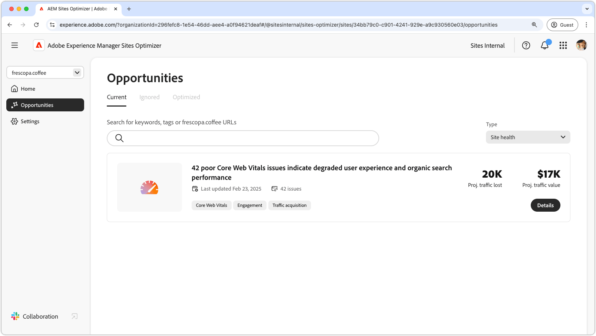

# Gezondheidsmogelijkheden van de site

{align="center"}

Het behoud van de gezondheid van sites in AEM Sites Optimizer is essentieel voor het bieden van snelle, betrouwbare en krachtige digitale ervaringen. Door kansen voor verbetering-zulke als Kernweb te identificeren kunnen de teams paginasnelheid, interactiviteit, en visuele stabiliteit optimaliseren om gebruikerservaring en onderzoekmachine rangschikkingen te verbeteren. Een goed onderhouden site zorgt voor vloeiender navigatie, betere betrokkenheid en verbeterde algehele prestaties. Door gebruik te maken van AEM Sites Optimizer-inzichten, kunt u de site voortdurend controleren en verfijnen, zodat deze efficiënt en effectief blijft.

## Kansen

<!-- CARDS

* ../documentation/opportunities/core-web-vitals.md
  {title=Core web vitals}
  {image=../assets/common/card-performance.png}

-->
<!-- START CARDS HTML - DO NOT MODIFY BY HAND -->

    

        

            

                <figure class="image x-is-16by9">
                    
                </figure>
            

            

                

                    

                        <a href="../documentation/opportunities/core-web-vitals.md" target="_blank" rel="referrer" title="Kernwebvitaliteit"> het Web vitals van de Kern </a>
                    

                    
Leer over de belangrijkste kansen van het Web vitals en hoe te om het te gebruiken om verkeersaanwinst te verbeteren.

                

                <a href="../documentation/opportunities/core-web-vitals.md" target="_blank" rel="referrer" class="spectrum-Button spectrum-Button--outline spectrum-Button--primary spectrum-Button--sizeM" style="align-self: flex-start; margin-top: 1rem;">
                     Leer meer 
                </a>
            

        

    

<!-- END CARDS HTML - DO NOT MODIFY BY HAND -->

