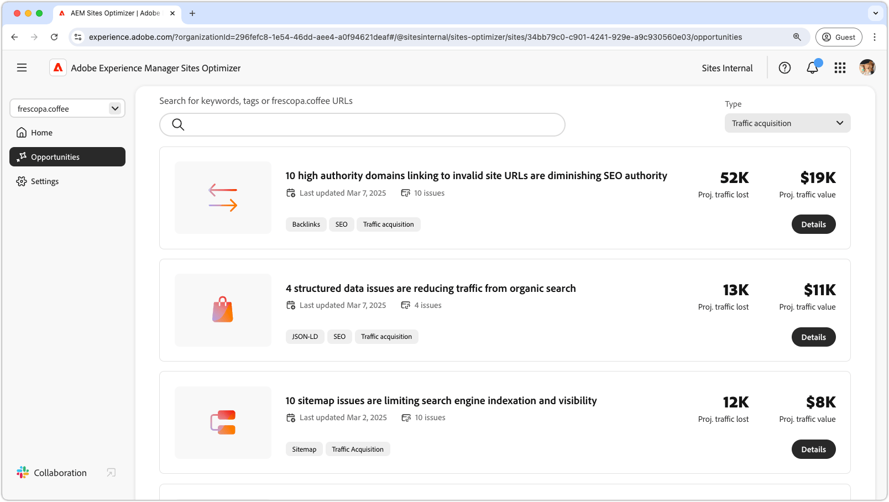

# Verkeersaankomstmogelijkheden

{align="center"}

Verkeersaanschaf drijft potentiële klanten naar uw website en creëert verkoop- of leadmogelijkheden. Door strategieën zoals de optimalisering van de onderzoeksmotor (SEO) te gebruiken, kunnen de ondernemingen onderzoekszicht verbeteren en het voor gebruikers gemakkelijker maken om hun inhoud te ontdekken. Een gestage stroom bezoekers vergroot het bewustzijn van merken en vergroot het vertrouwen. Het geeft ook waardevolle inzichten in gebruikersgedrag. Met deze inzichten kunnen teams hun aanbod verfijnen en de algehele ervaring verbeteren. Met behulp van AEM Sites Optimizer-inzichten kunt u doorlopend optimaliseren, een duurzame groei garanderen en de conversiegraad in de loop der tijd verbeteren.

## Kansen

<!-- CARDS
 
* ../documentation/opportunities/broken-backlinks.md
  {title=Broken backlinks}
  {image=../assets/common/card-arrows.png}
* ../documentation/opportunities/invalid-or-missing-metadata.md
  {title=Invalid or missing metadata}
  {image=../assets/common/card-code.png}
* ../documentation/opportunities/missing-invalid-structured-data.md
  {title=Missing or invalid structured data}
  {image=../assets/common/card-bag.png}
* ../documentation/opportunities/sitemap-issues.md
  {title=Sitemap issues}
  {image=../assets/common/card-relationship.png}

--->
<!-- START CARDS HTML - DO NOT MODIFY BY HAND -->

    

        

            

                <figure class="image x-is-16by9">
                    
                </figure>
            

            

                

                    

                        <a href="../documentation/opportunities/broken-backlinks.md" target="_blank" rel="referrer" title="Gebroken backlinks"> Gebroken backlinks </a>
                    

                    
Leer over de gebroken backlinks kans en hoe te om het te gebruiken om verkeersaanwinst te verbeteren.

                

                <a href="../documentation/opportunities/broken-backlinks.md" target="_blank" rel="referrer" class="spectrum-Button spectrum-Button--outline spectrum-Button--primary spectrum-Button--sizeM" style="align-self: flex-start; margin-top: 1rem;">
                     Leer meer 
                </a>
            

        

    

    

        

            

                <figure class="image x-is-16by9">
                    
                </figure>
            

            

                

                    

                        <a href="../documentation/opportunities/invalid-or-missing-metadata.md" target="_blank" rel="referrer" title="Ongeldige of ontbrekende metagegevens"> Ongeldige of ontbrekende meta-gegevens </a>
                    

                    
Leer over de ongeldige of ontbrekende meta-gegevenskans en hoe te om het te gebruiken om verkeersverwerving te verbeteren.

                

                <a href="../documentation/opportunities/invalid-or-missing-metadata.md" target="_blank" rel="referrer" class="spectrum-Button spectrum-Button--outline spectrum-Button--primary spectrum-Button--sizeM" style="align-self: flex-start; margin-top: 1rem;">
                     Leer meer 
                </a>
            

        

    

    

        

            

                <figure class="image x-is-16by9">
                    
                </figure>
            

            

                

                    

                        <a href="../documentation/opportunities/missing-invalid-structured-data.md" target="_blank" rel="referrer" title="Ontbrekende of ongeldige gestructureerde gegevens"> Ontbrekende of ongeldige gestructureerde gegevens </a>
                    

                    
Leer over de ontbrekende of ongeldige gestructureerde gegevenskans en hoe te om het te gebruiken om verkeersverwerving te verbeteren.

                

                <a href="../documentation/opportunities/missing-invalid-structured-data.md" target="_blank" rel="referrer" class="spectrum-Button spectrum-Button--outline spectrum-Button--primary spectrum-Button--sizeM" style="align-self: flex-start; margin-top: 1rem;">
                     Leer meer 
                </a>
            

        

    

    

        

            

                <figure class="image x-is-16by9">
                    
                </figure>
            

            

                

                    

                        <a href="../documentation/opportunities/sitemap-issues.md" target="_blank" rel="referrer" title="Sitemapproblemen"> kwesties Sitemap </a>
                    

                    
Meer informatie over de sitemap-uitkeringsmogelijkheid en over hoe u deze kunt gebruiken om het aanschaffen van verkeer te verbeteren.

                

                <a href="../documentation/opportunities/sitemap-issues.md" target="_blank" rel="referrer" class="spectrum-Button spectrum-Button--outline spectrum-Button--primary spectrum-Button--sizeM" style="align-self: flex-start; margin-top: 1rem;">
                     Leer meer 
                </a>
            

        

    

<!-- END CARDS HTML - DO NOT MODIFY BY HAND -->
